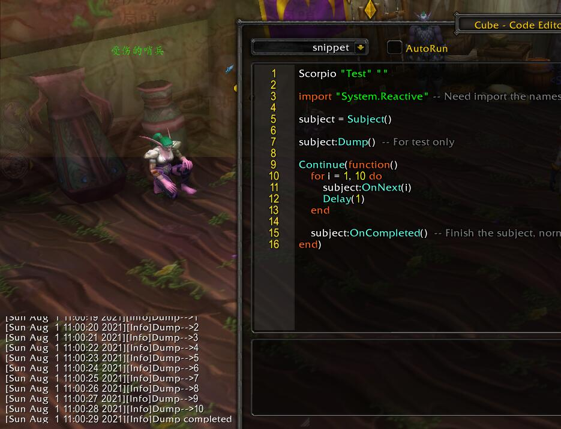
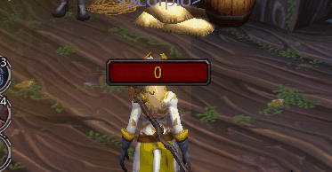
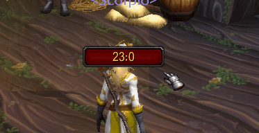

# The Observable Pattern And Wow


With [PLoop][] and [Scorpio][], we can use the obervable pattern in the Wow, it's a
very powerful and simple solution to create data sources and handle the data sources.

As an simple example, run this code in the [Cube][]:

```lua
Scorpio "Test" ""

-- The style will be introduced in the [004.ui.md], we need it to bind the observable data source and the ui
Style[UIParent] = {
    -- here a fontstring will be created on the center of the screen
    Label = {
        location  = { Anchor("CENTER") },

        -- Bind the label's text to an observable data source
        text = Wow.FromEvent("UNIT_HEALTH") -- An observable generate from the UNIT_HEALTH event
                :MatchUnit("player") -- A filter operation that only allow player
                :Map(UnitHealth),    -- A map operation that change the unit -> health
    }
}
```

Go for a combat and lose some health, you will find your health points is dynamically 
shown in the center of the screen(It won't shown when first loaded and the health is 
unchagned, the real usages for unit data will be introduced in the 
[UnitFrame.md](./006.unitframe.md)).

We won't go deeper in the whole observable system in the Wow, if you are interesting, check
the docs in the [PLoop](https://github.com/kurapica/PLoop).


## Wow.FromEvent
---

The `Wow.FromEvent` is the root API to generate an observable data source based on the 
system event(or custom sytem event). You can test those codes one by one:

```lua
-- print all event args of UNIT_HEALTH
Scorpio.Wow.FromEvent("UNIT_HEALTH"):Subscribe(print)

-- print the unit and its health
Scorpio.Wow.FromEvent("UNIT_HEALTH"):Map(function(unit) return unit, UnitHealth(unit) end):Subscribe(print)

-- only print player and its health
Scorpio.Wow.FromEvent("UNIT_HEALTH"):MatchUnit("player"):Map(function(unit) return unit, UnitHealth(unit) end):Subscribe(print)

-- Only print the BAG_UPDATE once per frame, The BAG_UPDATEA may occurs several times in the same time
Scorpio.Wow.FromEvent("BAG_UPDATE"):Next():Subscribe(function() print("BAG_UPDATE", GetTime()) end))

-- Use multi events as source
Scorpio.Wow.FromEvent("UNIT_HEALTH", "UNIT_MAXHEALTH"):Subscribe(print)
```

1. For the event, `Wow.FromEvent` will return the same observable data source.

2. We can use the observable's Subscribe method to bind any callbacks to receive the result dynamically.

3. We can use `Map` to convert the result to other values, also we can pass multi values.

4. For special unit events, we can use `MatchUnit` to filter the unit.

5. For frequently triggered events, it's better to delay and hanle only one in the next frame, that's how
    the `Next` works, it'll distinct the data sequences and delay them until the next frame(next tick by OnUpdate).

6. We can use multi-events as the data source, since we can't diff those events from the data sequences, they
    should use the same result structure, normally the UNIT events.


## Useful Observable Generator

Besides the `Wow.FromEvent`, there are several ways to create an Observable data source:

1. `Observable.Interval(interval[, max])` - emits a sequence of integers spaced by a given time interval.

2. `Observable.Timer(delay)` - emits a particular item after a given delay, works like the C_Timer.After.

3. Create your own Subject object and use its `OnNext` to send to data sequences.
    ```lua
    Scorpio "Test" ""

    import "System.Reactive" -- Need import the namespace

    subject = Subject()

    subject:Dump()  -- For test only

    Continue(function()
        for i = 1, 10 do
            -- the OnNext can send multi-data
            subject:OnNext(i, i^2, i^3)
            Delay(1)
        end

        subject:OnCompleted()  -- Finish the subject, normally don't needed in the Wow
    end)
    ```
    
    

    It's very useful when can't generate the data sequences directly based on several events.


## Operator

We have see the usages of `MatchUnit`, `Map`, `Next`. There are many operators to pre-handle the data
sequences before it reach the final subscriber.

Here is the list can be used by Wow(common operators can be found at [PLoop](https://github.com/kurapica/PLoop/blob/master/Docs/021.reactive.md).)

* Delay(delay) - time-shift an entire sequence.
    ```lua
    -- All data will be delayed for 1 sec
    Scorpio.Wow.FromEvent("UNIT_HEALTH"):Delay(1):Subscribe(print)
    ```

* Next([multi]) - Delay the sequence for one tick(per OnUpdate), and distinct the data sequence to 
    avoid the repeat works, the multi argument must set to true if the sequqnce send multi-datas.

* MatchUnit(unit) - The first data must match the unit to be continued, normally used for Unit events.
    ```lua
    -- All data will be delayed for 1 sec
    Scorpio.Wow.FromEvent("UNIT_HEALTH"):MatchUnit("player"):Next():Subscribe(print)
    ```

* Debounce(dueTime) - So the sequence can only be continued when the source don't send any more for a time.


## `__Observable__` And `Wow.FromUIProperty` And `Wow.FromPanelProperty`

In the Scorpio's UI part, the UI classes will contains the logic for user interaction, the property updating,
but no display logic will be contains. The display is done by Scorpio's Style system as skins, that means
the users can simply change how they display just by skin declarations.

So how the skin system know the ui object has changes its properties(its state) and show the correct display
effect, that's done by the `__Observable__` attributes:

```lua
Scorpio "Test" ""

import "System.Reactive"

-- This is a simple class, but if you want declare your own, ui class, you should
-- learn how to define the classes in the PLoop
class "CountButton" (function(_ENV)
    inherit "UIPanelButton"

    __Observable__()
    property "Count"  { type = Number, default = 0 }

    function __ctor(self)
        -- Bind a OnClick event handler to it
        -- Used to increase the Count
        self.OnClick = function(self)
            self.Count = self.Count + 1
        end
    end
end)

-- Now we display the count as the button's text
btn = CountButton("Test")

-- You can learn more about the Style system in the next chapter
Style[btn] = {
    location = { Anchor("CENTER") },
    size = Size(100, 26),
    text = Wow.FromUIProperty("Count"),
}
```


The `Wow.FromUIProperty` will try to find an observable property on the UI object or its parent(and parent's parent and etc), 
if found, the property's value and its changes will be used on the text style of the button.

The `Wow.FromUIProperty` can handle multi observable properties on once:

```lua
Scorpio "Test" ""

import "System.Reactive"

-- This is a simple class, but if you want declare your own, ui class, you should
-- learn how to define the classes in the PLoop
class "CountButton" (function(_ENV)
    inherit "UIPanelButton"

    __Observable__()
    property "Count"  { type = Number, default = 0 }

    __Observable__()
    property "Tick"   { type = Number, default = 0 }

    function __ctor(self)
        -- Bind a OnClick event handler to it
        -- Used to increase the Count
        self.OnClick = function(self)
            self.Count = self.Count + 1
        end

        Continue(function()
            while true do
                Delay(1)
                self.Tick = self.Tick + 1
            end
        end)
    end
end)

-- Now we display the count as the button's text
btn = CountButton("Test")

-- You can learn more about the Style system in the next chapter
Style[btn] = {
    location = { Anchor("CENTER") },
    size = Size(100, 26),
    text = Wow.FromUIProperty("Tick", "Count"):Map(function(t, c) return t .. ":" .. c end),
}
```




`Wow.FromUIProperty` is used for simple ui elements. But if we consider an ui element to show
all buffs of the player, we should display several icons with difference values, so that means
we need each icon provide their observable properties, and remember those icons could be dynamicly
added and removed since the buff count is dyanmaic.

So it can't be simply done by the Style system, since use it on dynamicly created icons will be
make style codes inside the logic codes, it against the design.

Check the [AuraPanel](../Scorpio.Unit/Modules/Indicator.lua#L89-L269) for an example:

```lua
Scorpio "Test" ""

import "System.Reactive"

class "AuraPanel" (function(_ENV)
    inherit "ElementPanel"
    
    -- For simple
    function Refresh(self)
        for i = 1, 8 do
            local name, icon, count, dtype, duration, expires, caster, isStealable, nameplateShowPersonal, spellID, canApplyAura, isBossDebuff, castByPlayer = UnitAura("player", i, "HELPFUL")
            if not name then break end
            
            print(name)
            
            self.Elements[i]:Show()
            
            -- So we use the panel's observable property not its elements.
            self.AuraIndex[i] = i
            self.AuraName[i] = name
            self.AuraIcon[i] = icon
            self.AuraCount[i] = count
            self.AuraDebuff[i] = dtype
            self.AuraCooldown[i] = { start = expires - duration, duration = duration }
            self.AuraStealable[i] = isStealable and not UnitIsUnit(unit, "player")
            self.AuraSpellID[i] = spellID
            self.AuraBossDebuff[i] = isBossDebuff
            self.AuraCastByPlayer[i] = castByPlayer
        end
    end
    
    ------------------------------------------------------
    -- Observable Property
    ------------------------------------------------------
    --- The indexer property works like self.AuraIndex[i] = value
    -- We don't really need save those values, so use an empty function as its set
    __Indexer__() __Observable__()
    property "AuraIndex" { set = Toolset.fakefunc }
    
    __Indexer__() __Observable__()
    property "AuraName" { set = Toolset.fakefunc }
    
    __Indexer__() __Observable__()
    property "AuraIcon" { set = Toolset.fakefunc }
    
    __Indexer__() __Observable__()
    property "AuraCount" { set = Toolset.fakefunc }
    
    __Indexer__() __Observable__()
    property "AuraDebuff" { set = Toolset.fakefunc }
    
    __Indexer__() __Observable__()
    property "AuraCooldown" { set = Toolset.fakefunc }
    
    __Indexer__() __Observable__()
    property "AuraStealable" { set = Toolset.fakefunc }
    
    __Indexer__() __Observable__()
    property "AuraSpellID" { set = Toolset.fakefunc }
    
    __Indexer__() __Observable__()
    property "AuraBossDebuff" { set = Toolset.fakefunc }
    
    __Indexer__() __Observable__()
    property "AuraCastByPlayer" { set = Toolset.fakefunc }
    
    function __ctor(self, ...)        
        self.OnElementCreated = function(self, ele)
            -- The style system will queue the apply style action for performance
            -- But sometimes we need force it done immediately
            return ele:InstantApplyStyle()
        end
    end    
end)

--- Define a icon class
class "AuraPanelIcon" { Frame }

-- Define the default styles for classes
Style.UpdateSkin("Default", {
    [AuraPanel] = {        
        elementType = AuraPanelIcon,
        rowCount = 2,
        columnCount = 2,
        elementWidth = 32,
        elementHeight = 32,
        hSpacing = 1,
        vSpacing = 1,
        orientation = Orientation.HORIZONTAL,
        topToBottom = false,
        leftToRight = true,
        location = { Anchor("CENTER") },
    },
    [AuraPanelIcon] = {
        backdrop = {
            edgeFile = [[Interface\Buttons\WHITE8x8]],
            edgeSize = 2,
        },
        
        -- Aura Icon
        IconTexture = {
            drawLayer = "BORDER",
            location = { Anchor("TOPLEFT", 2, - 2), Anchor("BOTTOMRIGHT", - 2, 2) },
            file = Wow.FromPanelProperty("AuraIcon"), -- Use the panel's observable property
            texCoords = RectType(0.1, 0.9, 0.1, 0.9),
        },
        
        -- Aura Count
        Label = {
            drawLayer = "OVERLAY",
            fontObject = NumberFontNormal,
            location = { Anchor("CENTER") },
            text = Wow.FromPanelProperty("AuraCount"):Map(function(val) return val and val > 1 and val or "" end),
        },
        
        -- Duration
        Cooldown = {
            setAllPoints = true,
            enableMouse = false,
            cooldown = Wow.FromPanelProperty("AuraCooldown"),
        },
    }
})


panel = AuraPanel("Test")

__SystemEvent__()
function UNIT_AURA(unit)
    if unit == "player" then panel:Refresh() end
end
```

`Wow.FromPanelProperty` works for the element panels, it'll check the icon's index and combine it with the panle's
indexer properties, so no matter how those icon is added/removed, the refresh logic is all done by the panel itself.

Luckly we only use this feature for the aura panels, and they are already done in the **Scorpio.Unit**.


[PLoop]: https://www.curseforge.com/wow/addons/PLoop  "PLoop Lib"
[Scorpio]: https://www.curseforge.com/wow/addons/Scorpio  "Scorpio Lib"
[Cube]: https://www.curseforge.com/wow/addons/igas-cube  "Cube Dev Tool"