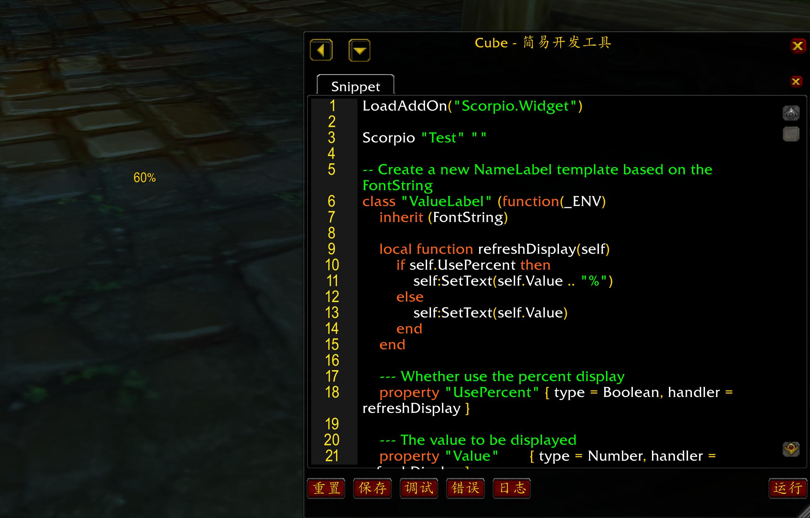

# The Scorpio UI Template & Skin System

The **Scorpio.UI** provide the basic ui template system and a skin system.

This chapter contains features would be hard for new ui beginners. You should check
the [004.widget.md](./004.widget.md) for simple usages first.


## Preparation

1. Please Install the [Cube][], you can use
    `/cube code` to open a code editor to test the UI codes, and use `/cube debug`
    to open a in-game browser to show the featuers of those UI classes(also you can
    use it browse items in any table). You should bind keys to open them in the
    key-binding frame for easy using.

2. If you create UI based on the Scorpio's UI system, make sure to add the
    `Scorpio.UI` as the Dependencies like:


``` toc
## Interface: 90005
## Title: Scorpio Test Addon
## Dependencies: Scorpio.UI
## DefaultState: Enabled
## LoadOnDemand: 0

# main files
ScorpioTest.lua
```

We'll use the [Cube][] to learn the blizzard's UI system and the Scorpio's UI Framework.


## The UI Elements & Xml Template

Blizzard use the XML to create UI elememts, the ui elements are used to display informations,
handle the user actions(mouse move, click, keyboard pressed).

UI elements are generated by widget types like **Frame**, **Button** and etc. Take a button as
the example, you can run it within the [Cube][]'s code editor:

```lua
local button = TestButton or CreateFrame("Button", "TestButton", UIParent, "UIPanelButtonTemplate")

button:SetSize(100, 26)
button:SetText("Click me")
button:SetPoint("CENTER")

button:SetScript("OnClick", function(self, button)
    print("Click " .. self:GetName() .. " with " .. button)
end)
```

Run it, you'll find a button in the center of the screen, click it and `Click TestButton with LeftButton`
will be print out. So here is the details:

1. We can use `CreateFrame("type", name, parent, template)` to create elements, the **type** provide
    the element method and script events.

2. With the given name, we can use `_G[name]` to access the element, also we can use `nil` since
    we already use local variable **button** to hold it.

3. The ui element must be created on another ui element, the root ui element normally is the
    **UIParent** which we use `ALT-Z` to toggle.

4. UI element have several methods provided by its widget type like the `SetSize`, `GetSize`,
    `SetText`, `GetText` and etc, normally they are method pairs to get/set display properties of the
    element.

5. UI element have script event like `OnClick` which will be triggered when user click the button.
    We can use `obj:SetScript(event, handler)` to bind event handler to it, so when we click
    the button, the code in the handler is processed as we can see.

6. The `UIPanelButtonTemplate` is a pre-defined xml template that contains common settings, like
    which texture to be displayed when press down the button, which font should be used to show
    the button's text and etc. Here is a simple version of it:

```xml
<!-- virtual means this is a template -->
<Button name="UIPanelButtonTemplate" virtual="true">
    <!-- The default size, x means width, y means height -->
    <Size x="40" y="22"/>

    <!-- The draw layers. see more in https://wow.gamepedia.com/Layer -->
    <Layers>
        <Layer level="BACKGROUND">
            <!-- try code `button.Left:Hide()` in the previous example -->
            <!-- so the template use three texture as the button's background -->
            <!-- each texture display part's of the same picture file -->
            <Texture parentKey="Left" file="Interface\Buttons\UI-Panel-Button-Up">
                <Size x="12" y="22"/>
                <!-- Check the https://wow.gamepedia.com/API_Region_SetPoint  -->
                <Anchors>
                    <!-- the Left Texture attach its topleft corner to the button's topleft corner -->
                    <Anchor point="TOPLEFT"/>
                    <!-- Also the Left Texture attach its bottomleft corner to the button's bottomleft corner -->
                    <Anchor point="BOTTOMLEFT"/>
                </Anchors>
                <!-- Only show a part of the picture file, check the https://wow.gamepedia.com/API_Texture_SetTexCoord -->
                <TexCoords left="0" right="0.09375" top="0" bottom="0.6875"/>
            </Texture>
            <Texture parentKey="Right" file="Interface\Buttons\UI-Panel-Button-Up">
                <Size x="12" y="22"/>
                <Anchors>
                    <Anchor point="TOPRIGHT"/>
                    <Anchor point="BOTTOMRIGHT"/>
                </Anchors>
                <TexCoords left="0.53125" right="0.625" top="0" bottom="0.6875"/>
            </Texture>
            <Texture parentKey="Middle" file="Interface\Buttons\UI-Panel-Button-Up">
                <Size x="12" y="22"/>
                <Anchors>
                    <Anchor point="TOPLEFT" relativeKey="$parent.Left" relativePoint="TOPRIGHT"/>
                    <Anchor point="BOTTOMRIGHT" relativeKey="$parent.Right" relativePoint="BOTTOMLEFT"/>
                </Anchors>
                <TexCoords left="0.09375" right="0.53125" top="0" bottom="0.6875"/>
            </Texture>
        </Layer>
    </Layers>
    <!-- The fontstring and font to display the text -->
    <ButtonText name="$parentText" parentKey="Text"/>
    <NormalFont style="GameFontNormal"/>
    <HighlightFont style="GameFontHighlight"/>
    <DisabledFont style="GameFontDisable"/>
    <HighlightTexture inherits="UIPanelButtonHighlightTexture"/>
</Button>
```

With the template, we don't need to set those settings by ourselves, but it also make it hard
to apply different display styles.


## Widget Types and Scorpio.UI

Let's open the [Cube][]'s browser, input the `Scorpio.UI.Button` and press the `Enter` key:


Although this is an ui class defined in the Scorpio Lib, it has the same **method** and **event** just
like the original **Button** widget. Normally you can learn their usages by their names, or just google
them, too many to be introduced here. But then we'll see a different style property system instead of
those methods, so You don't really need to remember them.

Now you can click the `UI`'s link, or just input the `Scorpio.UI` and press the `Enter` key, then scroll
down to the **Class** part:


Here is a list(not full) of the basic widget types(like the **Button**). Here is a simple introduction:

* Animations: Alpha, Animation, AnimationGroup, ControlPoint, LineScale, LineTranslation, Path, Rotation, Scale, Translation

    We can create animation group from any frames, then create animations like alpha, rotation from the
    animation group. It'd be used by well-experience authors, see [UIOBJECT_Animation](https://wow.gamepedia.com/UIOBJECT_Animation)
    for more details, no discuss here.

* Frames: Button, CheckButton, EditBox, ElementPanel(Scorpio Only), Frame, MessageFrame, ScrollFrame, Slider, StatusBar

    The most used widget types for user interactions, each provide special script events and methods.

* Text-Related: FontString

    The widget type used to display text, we need set a font to it before text display.

* Texture-Related: Line, MaskTexture, Texture

    The widget types used to display picture files, we only use **Texture** in this document.

* Models: CinematicModel, DressUpModel, Model, ModelScene, PlayerModel, TabardModel

    The widget types to display 3D models, no discuss here.

* Cooldown: Cooldown, CooldownLabel(Scorpio Only), CooldownStatusBar(Scorpio Only)

    The cooldown widget types, we'll see some usages later.

* Special: ColorSelect, SimpleHTML

    The special widget types, the Scorpio has already provided an API instead of the usage of the
    **ColorSelect**, check it in [004.widget.md](./004.widget.md). The SimpleHTML will
    be introduced in another document.

In this document, the **Frames**, **FontString** and **Texture** will be the main widget types to be used.


## Scorpio Style System

Now let's re-code the previous example within the **Scorpio UI Framework** without xml template(reload to clear
the previous example) :

```lua
Scorpio "Test" ""

button = Button("TestButton", UIParent)

-- The logic part, it's more easy to handle the OnClick script event
-- Also we can use __Async__ on it, so we can use Input to get the user inputs
__Async__()
function button:OnClick(button)
    print("Hello " .. Input("Please input your name"))
end


-- The display style part
Style[button] = {
    size                    = Size(100, 26),
    location 				= { Anchor("CENTER") },
    text 					= "Click Me",

    -- Font settings
    normalFont              = GameFontNormal,

    -- Texture settings
    LeftBGTexture           = {
        drawLayer           = "ARTWORK",
        file                = [[Interface\Buttons\UI-Panel-Button-Up]],
        texCoords           = RectType(0, 0.09375, 0, 0.6875),
        location            = {
            Anchor("TOPLEFT", 0, 0),
            Anchor("BOTTOMLEFT", 0, 0),
        },
        width               = 12,
    },
    RightBGTexture          = {
        file                = [[Interface\Buttons\UI-Panel-Button-Up]],
        texCoords           = RectType(0.53125, 0.625, 0, 0.6875),
        location            = {
            Anchor("TOPRIGHT", 0, 0),
            Anchor("BOTTOMRIGHT", 0, 0),
        },
        width               = 12,
    },
    MiddleBGTexture         = {
        file                = [[Interface\Buttons\UI-Panel-Button-Up]],
        texCoords           = RectType(0.09375, 0.53125, 0, 0.6875),
        location            = {
            Anchor("TOPLEFT", 0, 0, "LeftBGTexture", "TOPRIGHT"),
            Anchor("BOTTOMRIGHT", 0, 0, "RightBGTexture", "BOTTOMLEFT"),
        }
    },
}
```

As we can see, the styles are defined in a table, compare it to the xml, they use the same
properties like `file`, `size`, `texCoords` and etc.


The best part in here is we have split the logic part and the display part, so now we can
easily change the display of the button(no need to reload):

```lua
Scorpio "Test" ""

button = Button("TestButton", UIParent)

-- The logic part
function button:OnClick(button)
    print("Click " .. self:GetName() .. " with " .. button)
end


-- The display style part
Style[button] = {
    size                    = Size(100, 26),
    location 				= { Anchor("CENTER") },
    text 					= "Click Me",

    normalFont              = GameFontNormal,

    -- This is custom settings, we can use CLEAR to clear the previous settings
    LeftBGTexture           = CLEAR,
    RightBGTexture          = CLEAR,
    MiddleBGTexture         = CLEAR,

    -- Now we use the backdrop instead of the textuers
    backdrop                = {
        bgFile              = [[Interface\Tooltips\UI-Tooltip-Background]],
        edgeFile            = [[Interface\Tooltips\UI-Tooltip-Border]],
        tile                = true, tileSize = 16, edgeSize = 8,
        insets              = { left = 3, right = 3, top = 3, bottom = 3 }
    },
    backdropColor           = Color(0, 1, 0, 0.4),
}
```


## Style Property


So we only need modify the Style settings to change all the display effect.

Open the [Cube][]'s Browser, input the `Scorpio.UI.Button`, then scroll down to the
`Style Property` section:


Those are the **Button**'s style properties, they are all case ignored, so you can use
`size` or `Size` in the style settings table.

On the right of each property's name is the data type, you can click the **size**'s data
type:


That means it's a struct and the **size** property's value could be given by

```lua
Style[button].size = Size(100, 200)  -- Create the size value by struct name
Style[buttpn].size = { width = 100, height = 200 }  -- Or we can create the size value directly
```

Click the `<<<` on the browser, then click the data type of the **framestrata**:


That means the value of the **framestrata** is an enumeration, we can simply use it as string:

```lua
Style[button].framestrata = "LOW"
```

With the browser, we can simply know the properties that can be used by a widget type, and
how to give the value to those properties.

Besides the values that match the data type, the `CLEAR` can be used to clear the previous
custom settings and `NIL` can be used change the property value to default.

Although the Style system is designed for Scorpio UI Elements, but it also works for the
original ui elements.


## Style Child Property

Scroll down the browser to find the **Style Child Property** seciton, you can find the `leftbgtexture`,
`rightbgtexture` and others in it.


Unlike the **size**'s value like `{ width = 100, height = 26 }`, the value of a child property
is ui elements.

When we use child properties, we just set a table that contains the styles for the child property
value to the child property name. The style system will fetch an ui element from a recycle bin, add
it to the button, and apply the styles on the element.

In the previous example, we use `CLEAR` on the `LeftBGTexture`, so the texture should be removed
from the button, clear all custom styles and put back to the recycle bin.

So we can use those child properties to attach/detach ui elements to frames easily.


## Observable && Dynamic Values

Let's modify the previous example:

```lua
Scorpio "Test" ""

button = Button("TestButton", UIParent)
cooldownSubject = System.Reactive.Subject() -- An observable subject will be used to dynamic distribute values

-- The logic part
function button:OnClick(button)
    -- Send a cooldown status data, the same to { start = GetTime(), duration = 10 }
    cooldownSubject:OnNext( CooldownStatus(GetTime(), 10) )
end

-- The display style part
Style[button] = {
    size                    = Size(100, 26),
    location                 = { Anchor("CENTER") },
    text                     = "Click Me",

    normalFont              = GameFontNormal,

    backdrop                = {
        bgFile              = [[Interface\Tooltips\UI-Tooltip-Background]],
        edgeFile            = [[Interface\Tooltips\UI-Tooltip-Border]],
        tile                = true, tileSize = 16, edgeSize = 8,
        insets              = { left = 3, right = 3, top = 3, bottom = 3 }
    },
    backdropColor           = Color(0, 1, 0, 0.4),

    -- Use the cooldownlabel child property
    CooldownLabel            = {
        -- Set it to the button's right
        location             = { Anchor("LEFT", 0, 0, nil, "RIGHT") },
        -- Bind the cooldown property value to the subject
        -- Any observable objects can be used instead of the real value
        cooldown             = cooldownSubject,
    }
}
```

Click the button, we can see the cooldown label:


This is the basic mechanism that split the UI's logic and display part. Normally
we don't use the Subject directly, but it's also a simple solution to bind dynamic
values to the ui.

The reactive is a complex design pattern, won't discuss it here.


## UI Template Class & Class Skin System

In the previous example, we only show how to apply styles on a created button, those
settings are called **Custom Styles**.

Since we may need to create many buttons with the same style settings, and we also want
to have a mechanism to change all those button's style at once(change skins).

We need bring in the [PLoop][]'s class system to achieve it, but it won't be hard to learn.

Take an ui template definition from the SecureUIPanelTemplates.xml :

``` xml
<EditBox name="InputBoxTemplate" inherits="InputBoxScriptTemplate" virtual="true">
	<Layers>
		<Layer level="BACKGROUND">
			<Texture parentKey="Left" atlas="common-search-border-left" useAtlasSize="false">
				<Size x="8" y="20"/>
				<Anchors>
					<Anchor point="LEFT" x="-5" y="0"/>
				</Anchors>
			</Texture>
			<Texture parentKey="Right" atlas="common-search-border-right">
				<Size x="8" y="20"/>
				<Anchors>
					<Anchor point="RIGHT" x="0" y="0"/>
				</Anchors>
			</Texture>
			<Texture parentKey="Middle" atlas="common-search-border-middle">
				<Size x="10" y="20"/>
				<Anchors>
					<Anchor point="LEFT" relativeKey="$parent.Left" relativePoint="RIGHT"/>
					<Anchor point="RIGHT" relativeKey="$parent.Right" relativePoint="LEFT"/>
				</Anchors>
			</Texture>
		</Layer>
	</Layers>
	<FontString inherits="ChatFontNormal"/>
</EditBox>
```

The blizzard also provides **LargeInputBoxTemplate** since they have different display
styles. But they share the same functionality provided by the **InputBoxScriptTemplate**.

Here is the definition of the **InputBoxTemplate** in the Scorpio:

``` lua
Scorpio "Test" ""

-- Create the InputBox template class based on the EditBox class
class "InputBox" { EditBox }

-- Declare the default skin for the InputBox
Style.UpdateSkin("Default", {
    -- Should use the InputBox class as the key
    [InputBox]                  = {
        -- Set the font object, works the same to `<FontString inherits="ChatFontNormal"/>`
        fontObject              = ChatFontNormal,

        -- The Left Texture, the same to `<Texture parentKey="Left" ...`
        LeftBGTexture           = {
            -- We'll see more details of those settings later
            -- you also should compare it to the previous xml
            atlas               = {
                atlas           = [[common-search-border-left]],
                useAtlasSize    = false,
            },
            location            = {
                Anchor("TOPLEFT", -5, 0),
                Anchor("BOTTOMLEFT", -5, 0),
            },
            width = 8,
        },

        --- The Right Texture
        RightBGTexture          = {
            atlas               = {
                atlas           = [[common-search-border-right]],
                useAtlasSize    = false,
            },
            location            = {
                Anchor("TOPRIGHT", 0, 0),
                Anchor("BOTTOMRIGHT", 0, 0),
            },
            width = 8,
        },

        --- The Middle Texture
        MiddleBGTexture         = {
            atlas               = {
                atlas           = [[common-search-border-middle]],
                useAtlasSize    = false,
            },
            location            = {
                Anchor("TOPLEFT", 0, 0, "LeftBGTexture", "TOPRIGHT"),
                Anchor("BOTTOMRIGHT", 0, 0, "RightBGTexture", "BOTTOMLEFT"),
            }
        },
    },
})

-- Create the InputBox on a dialog box
dlg   = Dialog("Test")
input = InputBox("Edit", dlg)

-- Given custom styles to the ui elements,
-- like location, size and etc
Style[dlg] = {
    Header = {
        Text = "InputTemplate Test"
    },

    -- The children named Edit, it's the InputBox
    -- Unlike the child property, the children's name is case-sensitive
    Edit   = {
        location = { Anchor("CENTER") },
        size     = Size(200, 24),
    },
}
```

)

In the framework, we keep the functionality in the class definition(we'll see more
in other examples), and keep the display styles in the Style system, we can use
`Style.UpdateSkin` to update the styles for all the ui elements generated from the
template class, or use the `Style[obj]` to change the ui element's custom styles.

Here is how we change the skin of the InputBox:

```lua
Scorpio "Test" ""

Style.UpdateSkin("Default", {
    [InputBox]                  = {
        fontObject              = ChatFontNormal,

        -- We only use the backdrop settings instead of the three background texture
        backdrop                = {
            edgeFile = [[Interface\Buttons\WHITE8x8]],
            edgeSize = 3,
        },
        backdropBorderColor     = ColorType(0.6, 0.6, 0.6),
    },
})
```

The result would be like


The new skin will be applied to all the ui elements generated from the **InputBox**
template class.

There is no need to use `CLEAR` in the new skin since a skin author won't know the settings
in other skins, so the system will do the clear by itself.

With the **Scorpio.UI** framework, we can keep developing the functionality ui addons
and let the other authors create skins for those addons, we'll see how to creat new
skin and how to activate them. And we'll see how the skin system works.

We also can register a new skin and active it like :

```lua
Scorpio "Test" ""

-- Register an un-existed skin, case ignored
Style.RegisterSkin("Custom", {
    [InputBox]                  = {
        fontObject              = ChatFontNormal,

        -- We only use the backdrop settings instead of the three background texture
        backdrop                = {
            edgeFile = [[Interface\Buttons\WHITE8x8]],
            edgeSize = 3,
        },
        backdropBorderColor     = ColorType(0.6, 0.6, 0.6),
    },
})

-- Active the custom skin for the class
Style.ActiveSkin("Custom", InputBox)
```


## namespace

To meet the requirement that we can define the functionality and display styles in two
different addons, the first question is how we share the template classes among them.

``` lua
Scorpio "Test" ""

-- Declare the namespace for the addon
-- It's better to use the addon name as the namespace
namespace "Test"

class "InputBox" { EditBox }

-- So all classes defined in the file will be saved
-- in the Test namespace
print(InputBox) -- Test.InputBox

-- Start another addon
Scorpio "AnotherAddon" ""

-- The Scorpio.Widget also provided the InputBox
-- template class, so we can have same name classes
-- in different namespaces.
print(InputBox) -- Scorpio.Widget.InputBox

-- We can share those classes with the namespace
print(Test.InputBox) -- Test.InputBox
```


So, you'd better keep using `namespace "addonName"` in your code file to save the
classes. Then the skin addons can access them without conflict.


## The Definition of Style Property

The idea of the style system comes from the HTML + CSS. The html provide the DOM and the
functionality, the css provide the display styles.

To declare the display styles, we need define the style properties like **size**, **alpha**,
**location** and etc.

There are several ways to define the style properties. We'll start from the [Scorpio.UI/Property.lua](https://github.com/kurapica/Scorpio/blob/master/Scorpio.UI/Property.lua)

Take the **Alpha** style property as example:

``` lua
--- the frame's transparency value(0-1)
UI.Property         {
    name            = "Alpha",
    type            = ColorFloat,
    require         = { LayoutFrame, Line },
    default         = 1,
    get             = function(self) return self:GetAlpha() end,
    set             = function(self, alpha) self:SetAlpha(alpha) end,
}
```

So the property is defined by providing a table to the **UI.Property**. Here is the details:

Field               |Description
:-------------------|:---------------------------
name                | The property name, case ignored, required.
type                | The value type, besides the enum and struct types, you can also use Number, String, Boolean, Table for simple values.
require             | The property can't be used by all the ui elements, here we can set a template class or a list of template classes(in the table), the property can only be used by the ui elements generated from those template classes or classes inherited them.
set                 | The set function, required.
get                 | The get function, normally no need to set.
clear               | The clear style functions, used to clear the style settings.
default             | The default value of the style settings.
nilable             | Whether the property accept nil as value
depends             | A table contains the property names that should be applied before this. Like the `TexCoords` should be applied after the texture settings like `File`, `Altas`

The `clear`, `default` and `nilable` settings are used to clear the style settings, so if a skin
provided the `alpha` settings to 0.5, and we give it a new skin without the `alpha` settings, the
system will use the `default` value of the `Alpha` property to clear the alpha settings on all the
ui elements.

``` lua
LoadAddOn("Scorpio.Widget")

Scorpio "Test" ""

class "AlphaDialog" { Dialog }

dlg = AlphaDialog("AlphaTest")

Style.UpdateSkin("Default", {
    [AlphaDialog] = {
        alpha     = 0.3
    }
})
```


``` lua
LoadAddOn("Scorpio.Widget")

Scorpio "Test" ""

Style.UpdateSkin("Default", {
    [AlphaDialog] = {
    }
})
```


So the system can track all those skin changes to make sure the authors don't need to
roll back the skin settings before apply a new one.

The **Property.lua** almostly defined all the style properties that we need. There is no need
to create new one, so you only need to know how to use them.


## Auto-gen style property from the classes

**You can skip this section if no interesting to create complex template classes.**

The class system provided by the [PLoop][] is very powerful, we can define object properties in the classes:

``` lua
Scorpio "Test" ""

-- Create a new NameLabel template class based on the FontString
-- This is common way to define temlate classes
class "ValueLabel" (function(_ENV)
    inherit "FontString"

    local function refreshDisplay(self)
        if self.UsePercent then
            self:SetText(self.Value .. "%")
        else
            self:SetText(self.Value)
        end
    end

    --- Whether use the percent display
    -- You can learn more about the property in the PLoop
    property "UsePercent"  { type = Boolean, handler = refreshDisplay }

    --- The value to be displayed
    property "Value"       { type = Number, handler = refreshDisplay }
end)

label = ValueLabel("NumLabel")

label.Value = 60

Style[label] = {
    usePercent = true,
    location = { Anchor("CENTER") },
}
```



So the system will gather the object properties defined in the template class as
the style properties only works on the ui elements generated from the template class.


## The Creation of Template Classes

We already have several examples to show how to create simple template classes like

```lua
class "InputBox" { EditBox }
```

Those template class is only a derived type of the super class, it's still the same
ui class with different default skins.

A complex ui template will be a base ui element with several children(and their children),
also with several script event handlers:

```lua
Scorpio "Test" ""

namespace "Test"

class "InputDialog" (function(_ENV)
    inherit "Dialog"

    -- Bind the ConfirmButton's OnClick and InputBox's OnEnterPressed script event to the ui element's OnConfirm event
    __Bubbling__{ ConfirmButton = "OnClick", InputBox = "OnEnterPressed" }
    event "OnConfirm"

    event "OnCancel"

    local function RaiseOnCancel(self, ...)
        -- Raise the OnCancel events
        return OnCancel(self:GetParent(), ...)
    end

    -- Define The Methods
    function SetText(self, text)
        return self:GetChild("InputBox"):SetText(text)
    end

    function GetText(self)
        return self:GetChild("InputBox"):GetText()
    end

    -- Use __Template__ to declare the children of the ui element on the constructor
    -- They will be created automatically
    __Template__{
        InputBox = InputBox,
        ConfirmButton = UIPanelButton,
        CancelButton = UIPanelButton,
    }
    function __ctor(self)
        -- Another way to bind the child's script event to the ui element
        self:GetChild("CancelButton").OnClick = RaiseOnCancel
        self:GetChild("InputBox").OnEscapePressed = RaiseOnCancel
        self:GetChild("CloseButton").OnClick = RaiseOnCancel
    end
end)

-- Set the defualt skin
Style.UpdateSkin("Default", {
    [InputDialog] = {
        size = Size(360, 100),
        resizable = false,
        frameStrata = "FULLSCREEN_DIALOG",
        location = { Anchor("CENTER") },

        -- Child, unlike child property, case-sensitive
        InputBox = {
            location = { Anchor("TOP", 0, - 20) },
            size = Size(240, 32),
            autoFocus = true,
        },
        ConfirmButton = {
            text = _G.OKAY or "Okay",
            location = { Anchor("BOTTOMRIGHT", - 4, 16, nil, "BOTTOM") },
        },
        CancelButton = {
            text = _G.CANCEL or "Cancel",
            location = { Anchor("BOTTOMLEFT", 4, 16, nil, "BOTTOM") },
        }
    },
})

dlg = InputDialog("TestDialog")

-- Click Confirm to print the input text
function dlg:OnConfirm()
    print(dlg:GetText())
end

-- Click the Cancel or press Escape will close the dialog
function dlg:OnCancel()
    self:Hide()
end
```

The core part is using the `__Template__` to declare the children elements.

If you need to create child of child, you can do it like:

```lua
__Template__{
    ConfirmButton       = UIPanelButton,

    -- declare the children of child
    {
        ConfirmButton   = {
            Info        = FontString,
        },
    }
}
```

We'll see more style usage in the [006.unitframe.md](./006.unitframe.md).


## Tips

### The UI Element's Name and Full Path Name

Run the example in the [Cube][].

```lua
print(Scorpio("Cube.Editor").CodeDialog:GetName())

-- true means full path name
print(Scorpio("Cube.Editor").CodeDialog:GetName(true))  

-- parent.childname to access the child
print(Scorpio("Cube.Editor").CodeDialog.Editor:GetName(true)) 

-- We can get the element by the full name
print(Scorpio("Cube.Editor").CodeDialog.Editor == Scorpio.UI.UIObject.FromName("UIParent.Cube_Code_Editor.Editor"))

-- For non-Scorpio UI element, we can use UIObject.GetChild(parent, name) to get child
print(Scorpio("Cube.Editor").CodeDialog == Scorpio.UI.UIObject.GetChild(UIParent, "Cube_Code_Editor"))
```


Every ui elements created by the Scorpio UI System has its own name, unlike the `CreateFrame`, the
name is only usable to its parent. 

So the parent can use `parent.childname` to get its child(but use `GetChild` is recommend), and 
each have a full path name. We can use `Scorpio.UI.UIObject.FromName` to get the ui element 
by the full name.

For a special usage, type `/fstack`, use ctrl + click to open the wow debug window, you can find
the debug name is just the full path name. 


The Scorpio just store all those ui elements like trees. Normally the name won't be a problem.


### Location && Anchors

The most different property between the xml template and the Scorpio UI should be
the location property. 

```lua
--- the location of the LayoutFrame
UI.Property         {
    name            = "Location",
    type            = Anchors,
    require         = LayoutFrame,
    ... skip other ...
}
```

The property is defined for the LayoutFrame, so it can be used on almost all ui elements
expect the animations.

Its type is **Anchors**, which means it should be an array of **Anchor** values:


So normally we can use it like:

```lua
Style[buttn].location = {
    Anchor("TOPLEFT"), Anchor("BOTTOMRIGHT")
}
```

That means it will attach the button's topleft corner to its parent's topleft corner, and
attach th button's bottomright corner to its parent's bottomright corner, so just the same
size and same location of its parent, for that case, we can simply change it to

```lua
Style[button].setAllPoints = true
```

If you learn [SetPoint](https://wow.gamepedia.com/API_Region_SetPoint) method, the `point`, 
`x`, `y` and `relativePoint` won't be a problem.

The main problem is how the `relativeTo` works, not like the `SetPoint` API, it's a string 
value here and don't take ui elements as its value.

1. If `nil`, that means the relativeTo is the ui element's parent.

2. If is a simple name without ".", the relativeTo is the element's brother, the name could
    be the brother's name(if the brother is a child) or a child property name(it the brother
    is generated by the child property).

3. If the name contains "." then the name will be split into array can the Scorpio will try
    to fetch it with these rules:

    i. For the first part, if it's `$parent`, the current check element will be the ui element's
        parent. Otherwise, the System will try get it from the `_G`, normally the `UIParent`.

    ii. For the other parts, if the parent is `$parent`, the current check element will move to
        its parent, otherwise move to the current check element's children(or property child) by 
        the name.

    So a valid relativeTo could be `$parent.$parent.Editor.Header`

The most style property can be read, so if we want save/load a frame's location and size, we 
can done it simply:

```lua
function OnLoad()
    Style[frame].location = _SVDB.location
    Style[frame].size = _SVDB.size
end

function OnQuit()
    _SVDB.location = Style[frame].location
    _SVDB.size = Style[frame].size
end
```

The system will convert the relationship to a string.


[PLoop]: https://github.com/kurapica/PLoop  "PLoop Lib"
[Scorpio]: https://github.com/kurapica/Scorpio  "Scorpio Lib"
[Cube]: https://www.curseforge.com/wow/addons/igas-cube "Cube"