# Scorpio.Widget

The **Scorpio.Widget** provide common widgets and several useful APIs to simple
the usages of user interaction.

## Preparation

The **Scorpio.UI** is load on demand, it's not load until some addon need it, so
we should change the toc file, add depends on the Scorpio.UI, and the WOW will 
load the **Scorpio.UI** before your addon.

``` toc
## Interface: 80300
## Title: Scorpio Test Addon
## Dependencies: Scorpio.Widget
## DefaultState: Enabled
## LoadOnDemand: 0
## SavedVariables: ScorpioTest_DB
## SavedVariablesPerCharacter: ScorpioTest_DB_Char

# localization files
Locale\enUS.lua
Locale\zhCN.lua

# main files
ScorpioTest.lua
ScorpioTestMdl.lua
```

Also you can use 

``` lua
LoadAddOn("Scorpio.Widget")
```

to Force the loading of the Lib for testing code running in the Game.


## The User Interaction APIs

Like the `Next`, `Delay`, The Scorpio.Widget also provided several APIs
to be used in the coroutines. All those APIs can be used outside the Scorpio like
`Scorpio.Input(message, func)`.

1. `Alert(message[, func])` - Show an alert message dialog with the message. if
    the func is provided, the func will be called when the dialog is closed, if 
    the func is not provided and the `Alert` is called in a coroutine, the coroutine
    will be yield and will be resumed when the dialog is closed.

    ``` lua
    LoadAddOn("Scorpio.Widget")

    Scorpio "Test" ""

    Continue(function()
        Alert("Wait the click")
        print("The alert is closed")
    end)
    ```

    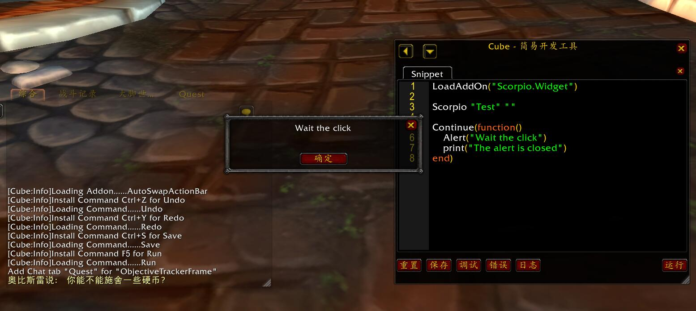


2. `Input(messag[, func])` - Show an input diaolog with the message, if the
    func is provided, the func will be called with the input data when the
    dialog is closed, if the func is not provided, the `Input` should be called
    in a coroutine, and resume the coroutine with the input data when click the
    Okay button or press Enter in the input box.

    ``` lua
    LoadAddOn("Scorpio.Widget")

    Scorpio "Test" ""

    Continue(function()
        print("Hello " .. Input("Please input your name"))
    end)
    ```

    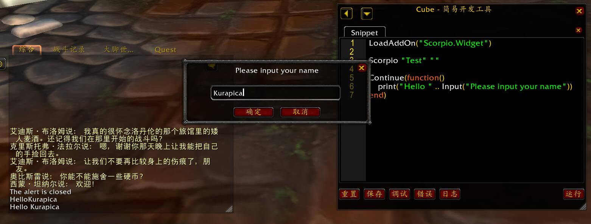


3. `Confirm(message[, func])` - Show a confirm dialog with the message, if the
    player click the OKay button, the `true` value will be returned, otherwise
    the `false` value will be returned. 

    If the func is provided, the func will be called with the result, otherwise,
    the `Confirm` must be used in a coroutine, and the result will be returned
    by the `Confirm` call.

    ``` lua
    LoadAddOn("Scorpio.Widget")

    Scorpio "Test" ""

    Continue(function()
        if Confirm("Do you want delete the item") then
            print("Yes")
        else
            print("No")
        end
    end)
    ```

    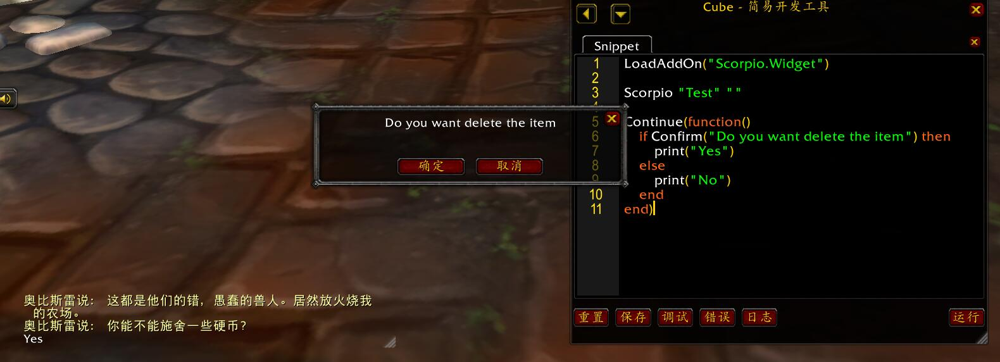


4. `PickColor([color[, func]])` - Show a color picker with the given color, if
    the func is provided, the func will be called with the selected color, if
    the func is not provided, the `PickColor` must be called within a coroutine,
    the coroutine will be yielded and the picked color will be returned by the
    `PickColor`.

    ``` lua
    LoadAddOn("Scorpio.Widget")

    Scorpio "Test" ""

    Continue(function()
        print(PickColor() .. "Text Color")
    end)
    ```

    The color value and the return values are dataes like `{ r=1, g = 1, b = 1}`

    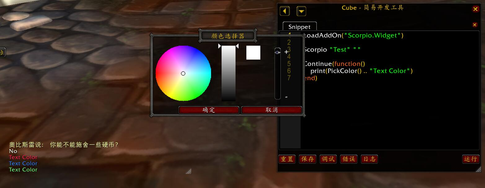


5. `PickOpacity([opacity[, func]])` - show a opacity picker with the given 
    opacity, if the func is provided, the func will be called with the picked
    opacity, otherwise the `PickOpacity` must be called in the corooutine, and
    the picked opacity will be returned.

    ``` lua
    LoadAddOn("Scorpio.Widget")

    Scorpio "Test" ""

    Continue(function()
        print("The Opacity is " .. PickOpacity(0.5))
    end)
    ```

    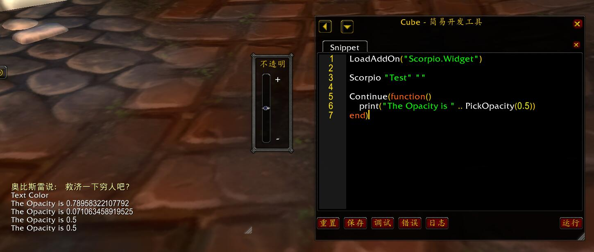

6. `PickRange(message, min, max, step[, value[, func]])` - show a range picker
    with the min, max and step settings, if the func is provided, the func will
    be called with the picked range value, otherwise, the `PickRange` should be
    called within a corooutine, and the picked range value will be returned.

    ``` lua
    LoadAddOn("Scorpio.Widget")

    Scorpio "Test" ""

    Continue(function()
        print("The value is " .. PickRange("Pick the value", 0, 10, 0.1))
    end)
    ```

    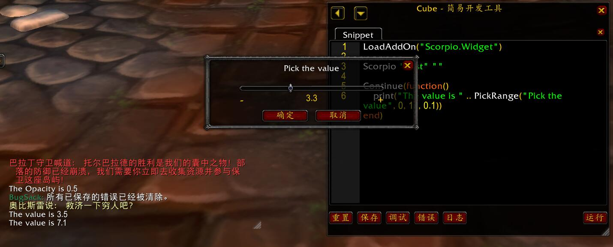

7. `ShowDropDownMenu(info)` - show the drop down list with the menu informations.
    This is a complex method since we should provide enough settings in the info
    table, like the text of menu buttons, the sub menu and etc.

    Here will be examples step by step to show how to use it.

    * **Click** - bind the click handler to the menu button, so click the menu 
        button will call the handler **within a coroutine, so we can use async APIs
        in it.**

        ``` lua
        LoadAddOn("Scorpio.Widget")

        Scorpio "Test" ""

        Continue(function()
            ShowDropDownMenu{
                {
                    text  = "Hello",
                    click = function()
                        print("Hello " .. Input("Please input your name"))
                    end,
                },
                {
                    text  = "Pick Value",
                    click = function()
                        print("The pick value is " .. PickRange("Pick Value", 0, 10, 1))
                    end,
                }
            }
        end)
        ```

        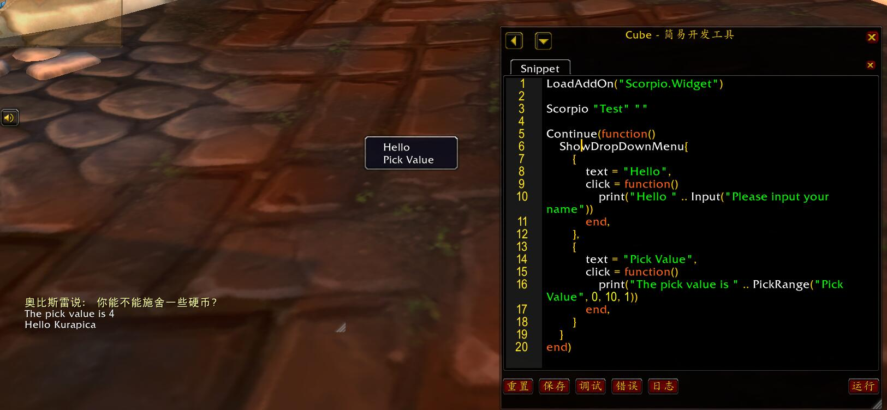

    * **Choose Color** - set the menu button as a color picker, the picked
        value will send to the click handler.

        ``` lua
        LoadAddOn("Scorpio.Widget")

        Scorpio "Test" ""

        Continue(function()
            ShowDropDownMenu{
                {
                    text = "Choose Color",
                    color = {
                        get = function() return { r = 1, g = 0, b = 0 } end,
                        set = function(color) print(color .. "New Color") end,
                    }
                },
                {
                    text = "Choose Color 2",
                    color = {
                        get = { r = 1, g = 0, b = 0 },
                        set = function(color) print(color .. "New Color") end,
                    }
                },
            }
        end)
        ```

        So the `color.get` can be the color value or a function used to return
        the color value.

        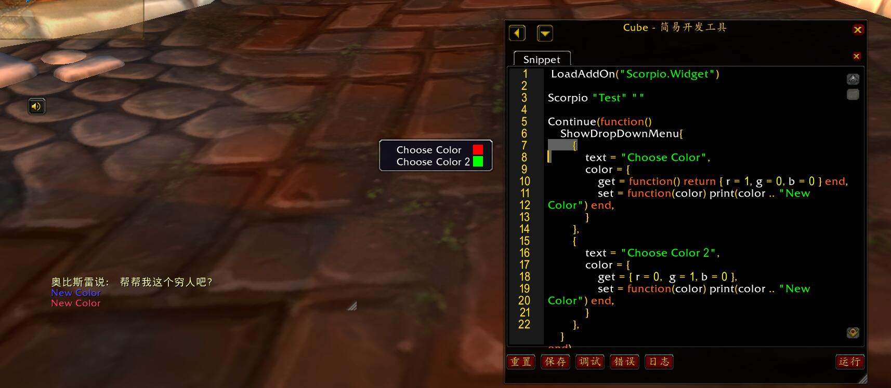

    * **Check Button** - The single check button.

        ``` lua
        LoadAddOn("Scorpio.Widget")

        Scorpio "Test" ""

        Continue(function()
            ShowDropDownMenu{
                {
                    text  = "UnCheck this",
                    check = {
                        get = function() return true end,
                        set = function(value) print("Check flag is " .. tostring(value)) end,
                    }
                },
            }
        end)
        ```

        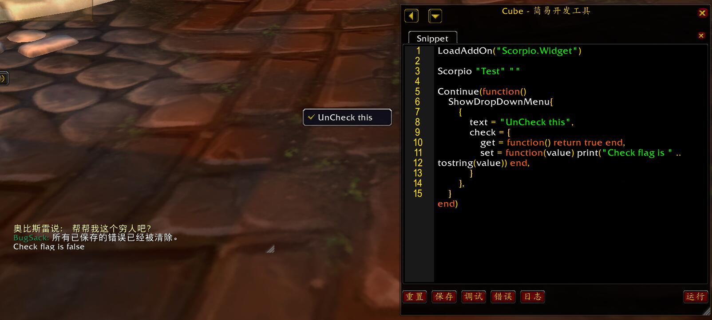

    * **Multi Raido Check Button** - since there should be several radio
        button, we can't keep the check settings in the button but the list.

        ``` lua
        LoadAddOn("Scorpio.Widget")

        Scorpio "Test" ""

        Continue(function()
            ShowDropDownMenu{
                check = {
                    get = function() return "B" end,
                    set = function(value) print("The player choose " .. value) end,
                },
                
                {
                    text = "Check Value A",
                    checkvalue = "A",
                },
                {
                    text = "Check Value B",
                    checkvalue = "B",
                },
                {
                    text = "Check Value C",
                    checkvalue = "C",
                },
            }
        end)
        ```

        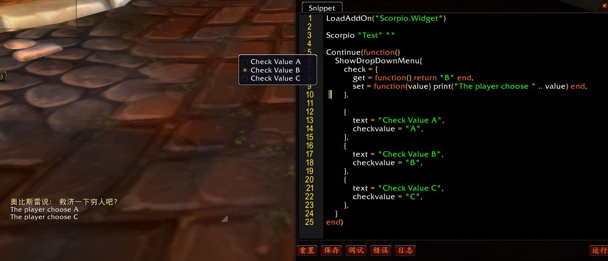

    * **Sub Menu** - we can define the sub menu in a menu button:

        ``` lua
        LoadAddOn("Scorpio.Widget")

        Scorpio "Test" ""

        Continue(function()
            ShowDropDownMenu{
                {
                    text  = "Choose value",
                    submenu = {
                        check = {
                            get = function() return "B" end,
                            set = function(value) print("The player choose " .. value) end,
                        },
                        
                        {
                            text = "Check Value A",
                            checkvalue = "A",
                        },
                        {
                            text = "Check Value B",
                            checkvalue = "B",
                        },
                        {
                            text = "Check Value C",
                            checkvalue = "C",
                        },
                    }
                }
            }
        end)
        ```

        There is no limit how many levels you can add.

        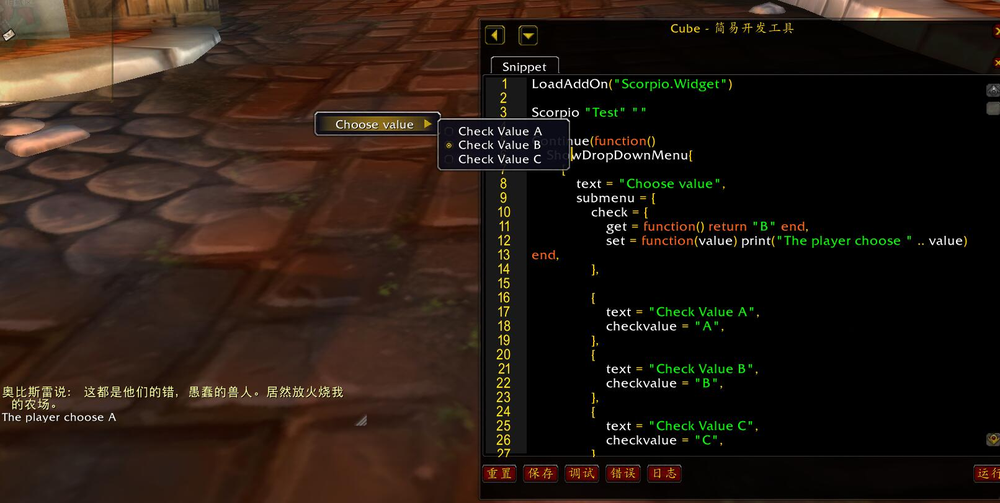

    * **Disbale the menu button** - just add `disabled=true` in 
        the menu button's config.

        ``` lua
        LoadAddOn("Scorpio.Widget")

        Scorpio "Test" ""

        Continue(function()
            ShowDropDownMenu{
                {
                    text  = "Choose value",
                    submenu = {
                        check = {
                            get = function() return "B" end,
                            set = function(value) print("The player choose " .. value) end,
                        },
                        
                        {
                            text = "Check Value A",
                            checkvalue = "A",
                            disabled = true,
                        },
                        {
                            text = "Check Value B",
                            checkvalue = "B",
                        },
                        {
                            text = "Check Value C",
                            checkvalue = "C",
                        },
                    }
                }
            }
        end)
        ```

        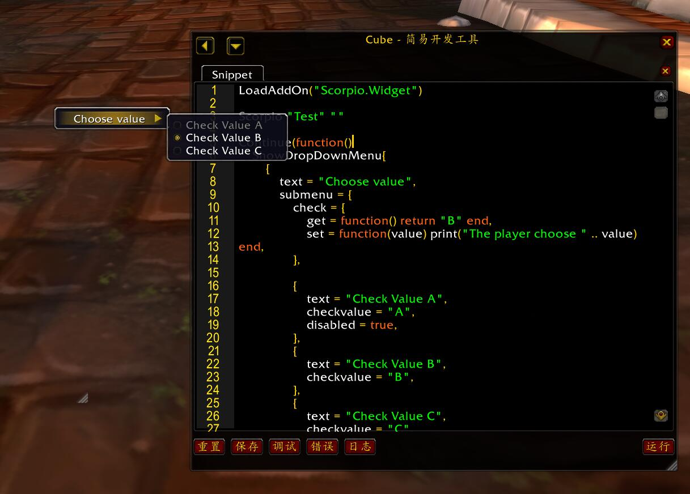

    * **Handle the Menu Close Event** - since the menu could
        be closed by time out or global mouse click, we may 
        need the notify when the menu is closed, so we can add
        close function on the root menu.

        ``` lua
        LoadAddOn("Scorpio.Widget")

        Scorpio "Test" ""

        Continue(function()
            ShowDropDownMenu{
                close = function()
                    print("The menu is closed")
                end,
                {
                    text  = "UnCheck this",
                    check = {
                        get = function() return true end,
                        set = function(value) print("Check flag is " .. tostring(value)) end,
                    }
                },
            }
        end)
        ```

        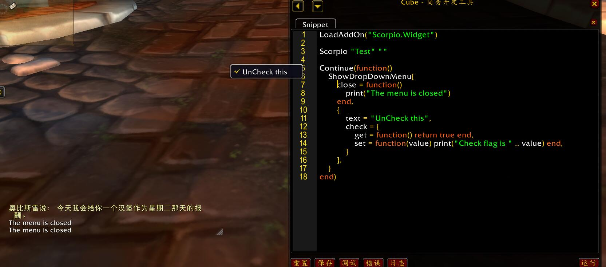

    * **The Owner and the Anchor** - the above examples show menu on the cursor,
        we can give the menu owner and the anchor at the root menu settings.

        The anchor can be `ANCHOR_TOPRIGHT`, `ANCHOR_RIGHT`, `ANCHOR_BOTTOMRIGHT`,
        `ANCHOR_TOPLEFT`, `ANCHOR_LEFT` and `ANCHOR_BOTTOMLEFT`, if use other anchor
        or no anchor, the cursor location will be used.

        ``` lua
        LoadAddOn("Scorpio.Widget")

        Scorpio "Test" ""

        local dlg = Dialog("Test")
        local button = UIPanelButton("Open", dlg)

        -- Change the dlg and button style
        Style[dlg] = {
            -- The dialog header settings
            Header = { Text = "Menu Test" },
            
            -- The button settings
            Open = {
                text = "Open Menu",
                location = { Anchor("CENTER") },
                size = Size(160, 26),
            }
        }

        -- The OnClick handler of the button
        function button:OnClick()    
            ShowDropDownMenu{
                owner = self,
                anchor = "ANCHOR_BOTTOMRIGHT",
                {
                    text = "UnCheck this",
                    check = {
                        get = function() return true end,
                        set = function(value) print("Check flag is " .. tostring(value)) end,
                    }
                },
            }
        end
        ```

        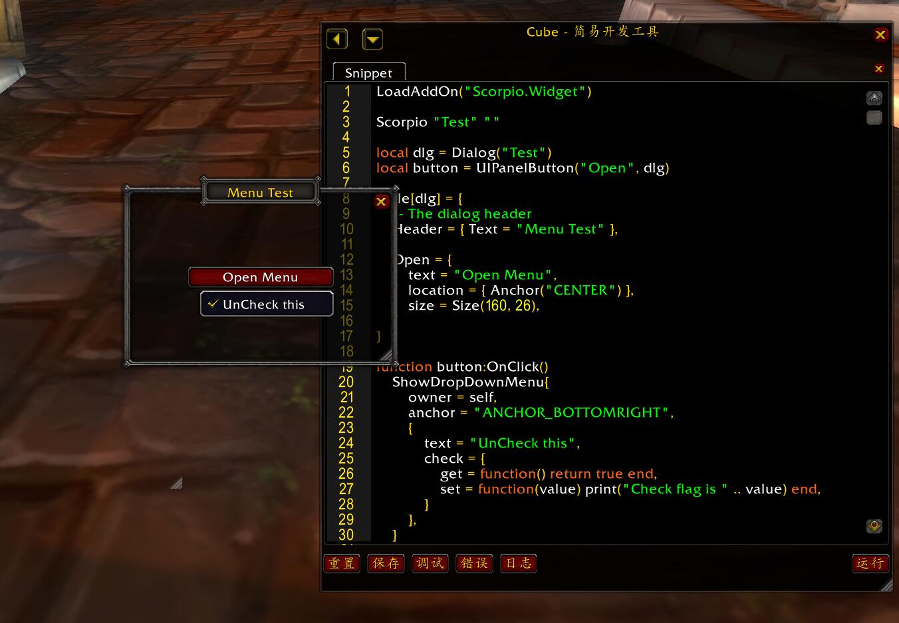
