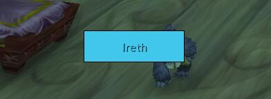
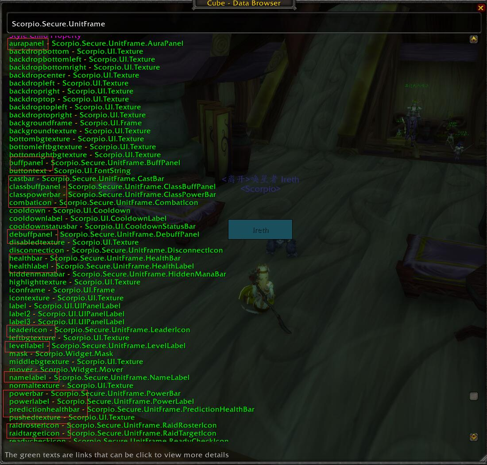
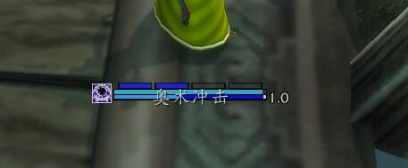
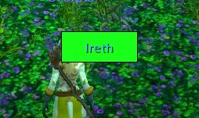

# Scorpio.Unit

## Scorpio.Secure.UnitFrame & Indicators

Let's start a simple example to create an unit frame represents the player:

```lua
Scorpio "Test" ""

import "Scorpio.Secure"

playerFrame                     = UnitFrame("Player")

Style[playerFrame]              = {
    unit                        = "player",
    location                    = { Anchor("CENTER") },
    size                        = Size(120, 36),

    healthBar                   = {
        setAllPoints            = true,

        frameStrata             = "LOW",
        enableMouse             = false,
        statusBarTexture        = {
            file                = [[Interface\Buttons\WHITE8x8]]
        },

        value                   = Wow.UnitHealth(),
        minMaxValues            = Wow.UnitHealthMax(),
        statusBarColor          = Wow.UnitColor(),

        backgroundFrame         = {
            frameStrata         = "BACKGROUND",
            location            = { Anchor("TOPLEFT", -1, 1), Anchor("BOTTOMRIGHT", 1, -1) },
            backgroundTexture   = {
                drawLayer       = "BACKGROUND",
                setAllPoints    = true,
                color           = Color(0.2, 0.2, 0.2, 0.8),
            },
            backdrop            = {
                edgeFile        = [[Interface\Buttons\WHITE8x8]],
                edgeSize        = 1,
            },

            backdropBorderColor = Color.BLACK,
        },
    },

    nameLabel                   = {
        location                = { Anchor("CENTER") },

        drawLayer               = "BORDER",
        fontObject              = GameFontNormalSmall,
        text                    = Wow.UnitName(true),
        textColor               = Wow.UnitColor(),
    },
}
```



The **UnitFrame** provide the basic secure unit frame mechanism and hover spell cast features.
That'll be introduced later.

We can use the Cube's Browser to check the `Scorpio.Secure.UnitFrame`, there are many special
child properties can be used as indicators, like the `healthBar` and `nameLabel`.



The declaration of those indicators are very simple, take the `nameLabel` as example:

```lua
-- Mark the NameLabel as UnitFrame class's child property(indicator)
__ChildProperty__(UnitFrame,         "NameLabel")

-- Mark the NameLabel as InSecureUnitFrame class's child property(indicator)
-- The InSecureUnitFrame are used on nameplate
__ChildProperty__(InSecureUnitFrame, "NameLabel")
__Sealed__() class "NameLabel"       { FontString }
```

You can check [Indicator.lua](https://github.com/kurapica/Scorpio/blob/master/Scorpio/Modules/Unit/Indicator.lua#L17-L83)
for more details.

The file also provide default skins for those indicators:

```lua
Style.UpdateSkin("Default",     {
    [NameLabel]                 = {
        drawLayer               = "BORDER",
        fontObject              = GameFontNormalSmall,
        text                    = Wow.UnitName(true),
        textColor               = Wow.UnitColor(),
    },
}
```

So we can simple the example like :

```lua
Scorpio "Test" ""

import "Scorpio.Secure"

playerFrame                     = UnitFrame("Player")

Style[playerFrame]              = {
    unit                        = "player",
    location                    = { Anchor("CENTER") },
    size                        = Size(120, 36),

    healthBar                   = {
        setAllPoints            = true,

        statusBarTexture        = {
            file                = [[Interface\Buttons\WHITE8x8]]
        },

        backgroundFrame         = {
            frameStrata         = "BACKGROUND",
            location            = { Anchor("TOPLEFT", -1, 1), Anchor("BOTTOMRIGHT", 1, -1) },
            backgroundTexture   = {
                drawLayer       = "BACKGROUND",
                setAllPoints    = true,
                color           = Color(0.2, 0.2, 0.2, 0.8),
            },
            backdrop            = {
                edgeFile        = [[Interface\Buttons\WHITE8x8]],
                edgeSize        = 1,
            },

            backdropBorderColor = Color.BLACK,
        },
    },

    nameLabel                   = {
        location                = { Anchor("CENTER") },
    },
}
```

You can check the [AshToAsh](https://www.curseforge.com/wow/addons/ashtoash) and [Aim](https://www.curseforge.com/wow/addons/aim)
to check usage of those indicators.


## Wow Dynamic Value API

In the previous example, we used `Wow.UnitHealth()`, `Wow.UnitHealthMax()` and other apis from
the Wow namespace, they are defined based on the Reactive system but easily to be used.

They'll check the binding ui element's parent until find an unit frame, and use the unit of the
frame(also dynamic) to generate the values based on different events to those ui element's style property.

Their definition can be found in [UnitAPI.lua](https://github.com/kurapica/Scorpio/blob/master/Scorpio/Modules/Unit/UnitAPI.lua),
[UnitCastAPI.lua](https://github.com/kurapica/Scorpio/blob/master/Scorpio/Modules/Unit/UnitCastAPI.lua),
[UnitHealthAPI.lua](https://github.com/kurapica/Scorpio/blob/master/Scorpio/Modules/Unit/UnitHealthAPI.lua) and
[UnitPowerAPI.lua](https://github.com/kurapica/Scorpio/blob/master/Scorpio/Modules/Unit/UnitPowerAPI.lua)

Take the `Wow.UnitThreatLevel` as an example:

```lua
__Static__() __AutoCache__()
function Wow.UnitThreatLevel()
    -- Wow.FromUnitEvent will bind the unit frame's unit and the UNIT_THREAT_SITUATION_UPDATE
    -- systen event to generate dynamic values(here the unit is the same for one element ui
    --, just triggered when the situation updated)
    return Wow.FromUnitEvent("UNIT_THREAT_SITUATION_UPDATE"):Map(function(unit)
        return UnitIsPlayer(unit) and UnitThreatSituation(unit) or 0
    end)
end
```

The `Wow.UnitThreatLevel` will send the number value, so if you want color instead of the number, you
can simply use the `Map` method:

```lua
-- change the name label's color to red if has some npc's threat, otherwise green
Style[nameLabel].Color = Wow.UnitThreatLevel():Map(function(val)
    if val > 0 then
        return Color.RED
    else
        return Color.GREEN
    end
end)
```

## Wow Unit API List

UNIT API                                                        |DESC
:---------------------------------------------------------------|:--------------
Wow.Unit() : unitId                                             |the unitId when the unit is changed(id or the unit is changed)
Wow.UnitName(withServer) : string                               |the unit name
Wow.UnitColor() : Color                                         |the unit class color
Wow.UnitExtendColor(withThreat) : Color                         |the unit extend color - For player class color only, For NPC, tap denied, threat and selection color
Wow.UnitLevel(format) : number                                  |the unit level
Wow.UnitClassification() : number                               |the unit classification: 'elite', 'rare', 'rareelite', 'worldboss', 'normal', 'trivial', 'minus'
Wow.UnitClassificationColor() : Color                           |the unit classification color like { r = 1, g = 1, b = 0 }
Wow.UnitLevelColor(default) : Color                             |the unit difficulty color
Wow.UnitAura() : unitId                                         |the unitId that aura changed, there is a one phase delay to block the frequent update for performance, the usage will be discussed later
Wow.UnitTotem() : unitId(just 'player')                         |the 'player' unitId when totem changed, the usage will be discussed later
Wow.UnitIsDisconnected() : boolean                              |whether the unit is disconnected
Wow.UnitIsTarget() : boolean                                    |whether the unit is the target
Wow.UnitIsPlayer() : boolean                                    |whether the unit is the player (equal to UnitIsUnit(unit, "player"))
Wow.UnitNotPlayer() : boolean                                   |whether the unit is not the player
Wow.PlayerInCombat() : boolean                                  |whether the player is in combat
Wow.UnitIsResurrect() : boolean                                 |whether the unit is in resurrect
Wow.UnitRaidTargetIndex() : number                              |the unit raid target index
Wow.UnitThreatLevel() : number                                  |the unit threat level
Wow.UnitGroupRoster() : string                                  |the unit group roster: 'MAINTANK', 'MAINASSIST', 'NONE'
Wow.UnitGroupRosterVisible() : boolean                          |whether the unit has group roster besides 'NONE'
Wow.UnitRole() : string                                         |the unit role: 'TANK', 'HEALER', 'DAMAGER', 'NONE'
Wow.UnitRoleVisible() : boolean                                 |whether the unit has role besides 'NONE'
Wow.UnitIsLeader() : boolean                                    |whether the unit is leader
Wow.UnitInRange() : boolean                                     |whether the unit is in the range of the player
Wow.UnitReadyCheckVisible() : boolean                           |whether should show the ready check flag
Wow.UnitReadyCheck() : string                                   |the ready check condition: 'ready', 'notready', 'waiting'
--------------------------------------------------------------------------------

Here is a code from the [Aim](https://github.com/kurapica/Aim/blob/master/DefaultSkin.lua#L163-L174),

```lua
Style.UpdateSkin("Default",     {
    [NamePlateUnitFrame]        = {
        HealthBar               = {
            SHARE_STATUSBAR_SKIN,

            location            = { Anchor("BOTTOMLEFT"), Anchor("BOTTOMRIGHT") },
            height              = BAR_HEIGHT,
            statusBarColor      = Wow.UnitExtendColor(true),
            value               = NIL,
            smoothValue         = Wow.UnitHealth(),
            backgroundFrame     = {
                backdropBorderColor = Wow.UnitIsTarget():Map(function(val) return val and Color.WHITE or  Color.BLACK end),
            },
        }
    },
})
```

The addon is works for the nameplate, so we use `Wow.UnitExtendColor(true)` for the heathbar's `statusBarColor` to see whether
the unit is attacked by others, whether is has threat to the player and etc.

Also we use the `smoothValue` instead of the `value` to get the unit health, so the status bar will display the health more
smoothing.

At the end, we use `Wow.UnitIsTarget():Map(function(val) return val and Color.WHITE or  Color.BLACK end)` to the `backdropBorderColor`
so the border color will change to white if the unit is the player's target.

As you can see, all those display logic are done in the style settings, the addon don't do this check in its main logic, it'll
be very simple to use another skin instead of the default to that addon.


### Aura Panel and elements

The unit api only provide a `Wow.UnitAura`, the auras should be displayed in an element panel, each element should be an icon to
display the aura's info, like icon, cooldown and etc.

Take the example from the [Aim AuraPanel Style](https://github.com/kurapica/Aim/blob/master/DefaultSkin.lua#L259-L276):

```lua
Style.UpdateSkin("Default",     {
    [NamePlateUnitFrame]        = {
        AuraPanel               = {
            -- The element type
            elementType         = AimAuraPanelIcon,

            -- The max row count
            rowCount            = 3,

            -- The max column count
            columnCount         = 4,

            -- The element width
            elementWidth        = 18,

            -- The element height
            elementHeight       = 18,

            -- The orientation of the element generation order
            orientation         = Orientation.HORIZONTAL,

            -- Whether generate the element from top to bottom
            topToBottom         = false,

            -- Whewther generate the element from left to right
            leftToRight         = true,

            -- The anchors
            location            = Wow.UnitIsPlayer():Map(function(isPlayer) return isPlayer and AURA_PANEL_PLAYER_LOCATION or AURA_PANEL_NON_PLAYER_LOCATION end),

            -- The aura filters like `HARMFUL`
            auraFilter          = Wow.Unit():Map(function(unit)
                                    return UnitIsUnit("player", unit) and "HELPFUL|INCLUDE_NAME_PLATE_ONLY"
                                        or (UnitReaction("player", unit) or 99) <= 4 and "HARMFUL|PLAYER|INCLUDE_NAME_PLATE_ONLY"
                                        or ""
                                    end),

            -- The custom filter function to check each aura infomations
            customFilter        = function(name, icon, count, dtype, duration) return duration and duration > 0 and duration <= 60 end,

            -- the aura priority, the spell id or name in here will be displayed first
            auraPriority        = { 774, 48438 },
        },
    },
})
```

You can use the Cube's browser to check the properties of the `Scorpio.UI.ElementPanel`. So those panel are just grid
to contains icon elements.


We can find the `AimAuraPanelIcon`'s defintion at [Aim AuraPanelIcon](https://github.com/kurapica/Aim/blob/master/DefaultSkin.lua#L15)

```lua
-- So it's only derived class of the Scorpio.Secure.UnitFrame.AuraPanelIcon
class "AimAuraPanelIcon"   { Scorpio.Secure.UnitFrame.AuraPanelIcon }
```

And its skin at [Aim AuraPanelIcon Style](https://github.com/kurapica/Aim/blob/master/DefaultSkin.lua#L83-L120), skip the non api part:

```lua
Style.UpdateSkin("Default",     {
    -- The icon style
    [AimAuraPanelIcon]          = {
        backdropBorderColor     = Wow.FromPanelProperty("AuraDebuff"):Map(function(dtype) return AURA_PANEL_ICON_DEBUFF_COLOR[dtype] or Color.WHITE end),

        -- Aura Icon
        IconTexture             = {
            file                = Wow.FromPanelProperty("AuraIcon"),
        },

        -- Aura Count
        Label                   = {
            text                = Wow.FromPanelProperty("AuraCount"):Map(function(val) return val and val > 1 and val or "" end),
        },

        -- Stealable
        MiddleBGTexture         = {
            visible             = Wow.FromPanelProperty("AuraStealable"),
        },

        -- Duration
        CooldownLabel           = {
            cooldown            = Wow.FromPanelProperty("AuraCooldown"),
        },
    },
})
```

Skip the details, those icon can use `Wow.FromPanelProperty` to dynamic get the aura informations, here is the list of those panel property:

Aura Panel Property                                             |DESC
:---------------------------------------------------------------|:--------------
AuraIndex : number                                              |the aura index
AuraName : string                                               |the aura name
AuraIcon : string                                               |the aura icon
AuraCount : number                                              |the aura count
AuraDebuff : string                                             |the aura debuff type: 'Magic', 'Curse', 'Disease', 'Poison'
AuraCooldown : cooldown                                         |the aura cooldown
AuraStealable : boolean                                         |whether the buff is stealable
AuraSpellID : number                                            |the aura spell id
AuraBossDebuff : boolean                                        |whether the aura is a boss debuff
AuraCastByPlayer : boolean                                      |whether the aura is cast by the player
--------------------------------------------------------------------------------

Although if you want learn how it works, you should learn the [PLoop][]'s index property and the reactive system, but
through those examples, it's not hard to use them directly.


### Totem Panel

Just like the Aura Panel, You can check [Aim TotemPanel Style](https://github.com/kurapica/Aim/blob/master/DefaultSkin.lua#L278-L283),
[Aim TotemPanelIcon](https://github.com/kurapica/Aim/blob/master/DefaultSkin.lua#L16) and
[Aim TotemPanelIcon Style](https://github.com/kurapica/Aim/blob/master/DefaultSkin.lua#L121-L141).

The Totem Panel also provide several panel property like:

Totem Panel Property                                            |DESC
:---------------------------------------------------------------|:--------------
TotemName : string                                              |the totem name
TotemIcon : string                                              |the totem icon
TotemCooldown : cooldown                                        |the totem cooldown
--------------------------------------------------------------------------------


## Unit Cast API

Cast API                                                        |DESC
:---------------------------------------------------------------|:--------------
Wow.UnitCastCooldown() : cooldown                               |the unit cast cooldown
Wow.UnitCastChannel() : boolean                                 |whether the unit is cast channel spell
Wow.UnitCastInterruptible() : boolean                           |whether the unit casting can be interruptibled
Wow.UnitCastName() : string                                     |the casting spell name
Wow.UnitCastIcon() : string                                     |the casting spell icon
Wow.UnitCastDelay() : number                                    |the cast delay
--------------------------------------------------------------------------------

You can check [Aim CastBar](https://github.com/kurapica/Aim/blob/master/DefaultSkin.lua#L204-L258) for the usages


## Unit Health API

Health API                                                      |DESC
:---------------------------------------------------------------|:--------------
Wow.UnitHealth() : number                                       |the unit health
Wow.UnitHealthFrequent() : number                               |the unit health with COMBAT_LOG booster, more frequently
Wow.UnitHealthPercent() : number                                |the unit health percent
Wow.UnitHealthPercentFrequent() : number                        |the unit health percent with COMBAT_LOG booster, more frequently
Wow.UnitHealthMax() : number                                    |the unit max health
Wow.UnitHealPrediction() : unitId                               |fired when the unit predition changes
Wow.UnitConditionColor(useClassColor, smoothEndColor) : color   |the unit condition color(debuff color, class color smooth color change based on health percent)
--------------------------------------------------------------------------------

The `Wow.UnitHealthFrequent()` is boosted by the COMBAT_LOG_EVENT, so should be used in the raid panels.

For the `smoothEndColor`, if we set to `Color.RED`, the lower health, the color will smoothly converted to the
red color.

It's complex to handle the health prediciton, so the system provide a `PredictionHealthBar` to simple the task,
you can check the [AshToAsh HealthBar](https://github.com/kurapica/AshToAsh/blob/master/DefaultSkin.lua#L122-L129),
we only need change the bar's style to use it. For curious people, you can check the
[Defintion of the PredictionHealthBar](https://github.com/kurapica/Scorpio/blob/master/Scorpio/Modules/Unit/Indicator.lua#L403-L578) and
[Default Style of PredictionHealthBar](https://github.com/kurapica/Scorpio/blob/master/Scorpio/Modules/Unit/Indicator.lua#L782-L852),
it's complex so not recommend.


## Unit Power API

Power API                                                       |DESC
:---------------------------------------------------------------|:-------------
Wow.ClassPower() : number                                       |the unit class power
Wow.ClassPowerMax() : number                                    |the unit class max power
Wow.ClassPowerColor() : Color                                   |the unit class power color
Wow.ClassPowerUsable() : boolean                                |whether should show the unit class power
Wow.UnitPower(frequent) : number                                |the unit power
Wow.UnitPowerMax() : number                                     |the unit max power
Wow.UnitPowerColor() : Color                                    |the unit power color
Wow.UnitMana() : number                                         |the unit mana
Wow.UnitManaMax() : number                                      |the unit mana max
Wow.UnitManaVisible() : boolean                                 |whether should show the unit mana bar

The usage of the class power may be a little complex, but you can check the
[Aim ClassPowerBar](https://github.com/kurapica/Aim/blob/master/ClassPowerIndicator.lua),
[Aim PowerBar Style](https://github.com/kurapica/Aim/blob/master/DefaultSkin.lua#L175-L197).

The style works like:




## Raid Panel and Hover Spell Binding

When you create your own UnitFrame class and styles, you can easily convert it to a raid panel

```lua
Scorpio "Test" ""

import "Scorpio.Secure"

-- Define the unit frame
class "MyUnitFrame" { UnitFrame }

Style.UpdateSkin("Default", {
    [MyUnitFrame]                   = {
        -- Declare the hover spell group
        hoverSpellGroup             = "MyUnitFrameHoverGroup",

        healthBar                   = {
            setAllPoints            = true,

            statusBarTexture        = {
                file                = [[Interface\Buttons\WHITE8x8]]
            },

            backgroundFrame         = {
                frameStrata         = "BACKGROUND",
                location            = { Anchor("TOPLEFT", -1, 1), Anchor("BOTTOMRIGHT", 1, -1) },
                backgroundTexture   = {
                    drawLayer       = "BACKGROUND",
                    setAllPoints    = true,
                    color           = Color(0.2, 0.2, 0.2, 0.8),
                },
                backdrop            = {
                    edgeFile        = [[Interface\Buttons\WHITE8x8]],
                    edgeSize        = 1,
                },

                backdropBorderColor = Color.BLACK,
            },
        },

        nameLabel                   = {
            location                = { Anchor("CENTER") },
        },
    }
})

-- Use it in a raid panel
raidPanel                           = SecureGroupPanel("MyRaidPanel")

Style[raidPanel]                    = {
    ElementType                     = MyUnitFrame,
    ElementPrefix                   = "MyUnitFrameUnit",

    location                        = { Anchor("CENTER", 30, 0) },
    columnCount                     = 4,
    rowCount                        = 5,
    elementWidth                    = 80,
    elementHeight                   = 32,
    orientation                     = "VERTICAL",
    leftToRight                     = true,
    topToBottom                     = true,
    hSpacing                        = 2,
    vSpacing                        = 2,
}

-- Bind the hover spell
SpellGroupAccessor                  = UnitFrame.HoverSpellGroups["MyUnitFrameHoverGroup"]

-- Arcane Intellect Bind to left click
SpellGroupAccessor.Spell[1459].Key  = "BUTTON1"
```

So we only need create a custom unit frame class, and use it as the **SecureGroupPanel**
element, we get a raid panel.



Then we only need to improve the skin of the custom unit frame class, we'll get a powerful
raid panel addon.

But I strongly recommend you should try the [AshToAsh](https://www.curseforge.com/wow/addons/ashtoash)
Addon first, and just make the skin for it directly, since it already done many basic features
for the raid panel addons.


[PLoop]: https://github.com/kurapica/PLoop  "PLoop Lib"
[Scorpio]: https://github.com/kurapica/Scorpio  "Scorpio Lib"
[Cube]: https://www.curseforge.com/wow/addons/igas-cube "Cube"