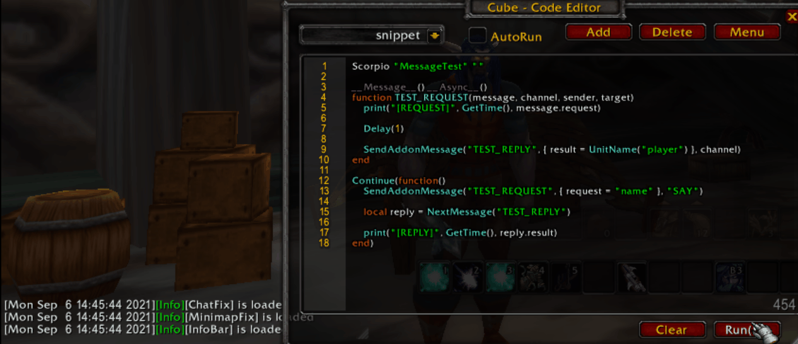

# Addon Messages and Encoders


## Addon Messages

We can exchanges datas between players with the Scorpio's Message Framwork, take one example as the start :

```lua
Scorpio "MessageTest" ""

-- Register a message handler for message with TEST_REQUEST as prefix
__Message__()
function TEST_REQUEST(message, channel, sender, target)
    print("[REQUEST]", message.request)

    -- Send the Addon message, this is not the C_ChatInfo.SendAddonMessage
    -- It's a Scorpio version and can only be used in Scorpio's modules
    -- It use the same arguments as the C_ChatInfo.SendAddonMessage
    -- but the message could be any lua datas
    --
    -- So here we send a reply back to the client
    SendAddonMessage("TEST_REPLY", { result = GetTime() }, channel)
end

-- Run an async function to send and receive the result
Continue(function()
    -- Send the request (this tested in the classic client, so we can use SAY as the channel)
    SendAddonMessage("TEST_REQUEST", { request = "time" }, "SAY")

    -- Wait the replay message, works like NextEvent
    local reply = NextMessage("TEST_REPLY")

    print("[REPLY]", reply.result)
end)
```



To send a lua data, normally we need serialzie it first, then use deflate to zip it, then
encode it into Base64(or other format) so it can be send. And when the client receive the
message, it need decode and deserialize. Also the zip and encode require more cpu usages, 
it may freeze the game for a little time, so we need bring in the async to smooth the effect.

The `Scorpio.SendAddonMessage` will handle the messages with those steps:

1. Queue each addon message, and will handle them in the next phase(per OnUpdate).

2. Dequeue those addon messages, combine them based on the chatType, channel and target, so
    the messages to the same destination will be packed into the one(based on the length).

3. Serialzie the mergered message, deflate the result asynchronously, then encode the result
    to Base64 asynchronously.

4. Split the final result into several packet, each packet has an index, so the final message
    will be like `AB123D:AC:AB:xxxxxxxxxxxxxxxxxxxxxxxxxxxxxxxxxx`, the first six-byte is the 
    unique id, the next `AC` is the total packet count(a 26-based number, AC means 2), the next
    `AB` is the packet index, which `AB` means 1. The final part is the splitted message.

5. Those packets will be send to the destination asynchronously without hitting blz's limitation.

5. When the client receive the packet, it'll combine them by the unique id. And decode them 
    asynchronously. Then distribute the message based on the prefix.

Those are common but complex steps and you can leave them to the Scorpio. The `SendAddonMessage`
use the same arguments just like the `C_ChatInfo.SendAddonMessage`.


```lua
Scorpio.SendAddonMessage(prefix, message[, chatType[, target]][, callback|true])
```

* prefix - The message prefix, they are registered to the Scorpio, not the game, so just defined
    an unique string started with your addon name will be fine.

* message - The message, could be string, number, table with complex structs. The receiver will
    get the same value(through the deserialization).

* chatType - For retail, "PARTY", "RAID", "INSTANCE_CHAT", "GUILD", "OFFICER", "WHISPER", "CHANNEL"
    are supported, for classic, "PARTY", "RAID", "INSTANCE_CHAT", "GUILD", "OFFICER", "WHISPER",
    "SAY", "YELL" are supported.

* target - If the chatType is `WHISPER`, then the target should be the user's name, if the chatType
    is "CHANNEL", the target should be the channel id.

* callback - the callback function, if use true, then the `SendAddonMessage` will yield the caller
    and resume it when the message is sent.


## Scorpio.NextMessage

The NextMessage is works like the `Wait`:

```lua
Scorpio.NextMessage(prefix[, callback][, timeout])
```

* prefix - The waiting message's prefix.

* callback - The callback to receive the `message, channel, sender, target`, if not provided and
    the API is called in a coroutine, the coroutine will be yield and when the message arrived,
    the system will resume the coroutine and return the result from the `NextMessage`.

* timeout - We can specific a timeout to stop the waiting, then nil will be send back or call the
    callback with the nil value.


## Encoder

The Scorpio has provide four API for encode & decode

* Scorpio.Base64Encode(str)     -- encode the data to Base64, if this is called in a coroutine, it'll be processed asynchronously.
* Scorpio.Base64Decode(str)     -- decode the Base64 data, if this is called in a coroutine, it'll be processed asynchronously.
* Scorpio.DeflateEncode(str)    -- zip the data, if this is called in a coroutine, it'll be processed asynchronously.
* Scorpio.DeflateDecode(str)    -- unzip the data, if this is called in a coroutine, it'll be processed asynchronously.