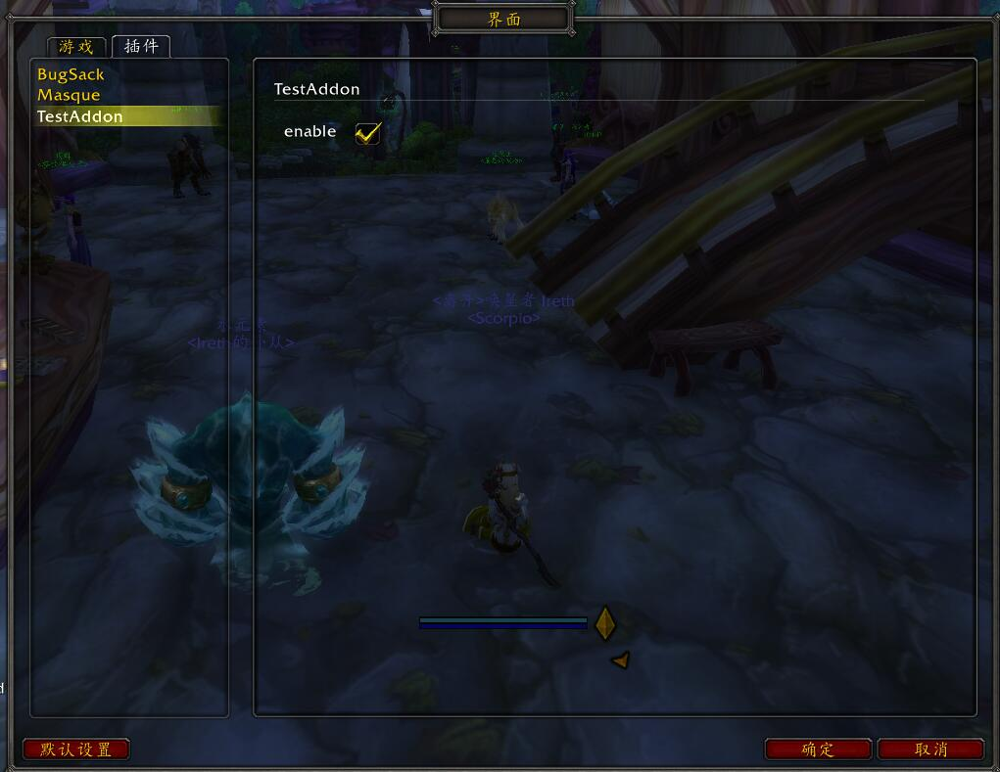

# ConfigNode

The config node system is used for adddon configurations, it's designed on the saved variables, but will black box the details. Please don't use it combined with SVMananger(you still can use it, but not recommend).

The config nodes are pre-defined, we can declare the config field with data type and the field value handler, the system can  automatically generate the config UI panel for the addon based on those settings.

## A simple start

Here is an example addon to show how to use the config node system, a simple addon have one saved variables:

```toc
## Interface: 90207
## Dependencies: Scorpio
## SavedVariables: TestAddonSave

# Core
TestAddon.lua
```

With one config field `enable`, and a slash command to show the config panel.

```lua
Scorpio "TestAddon" ""

function OnLoad()
	_Addon:SetSavedVariable("TestAddonSave") -- Bind the saved variable where the config is saved
		:UseConfigPanel()                  -- Enable the auto-gen config panel
end

-- Declare a config field with default value
__Config__(_Config, true)
function Enable(enabled)
	print("[Config]The addon is " .. (enabled and "enabled" or "disabled"))
end

--- Declare a slash command to open the config panel
__SlashCmd__ "test"
function OnSlashCmdOpen()
	_Addon:ShowConfigUI()
end

--- Declare a slash command to enable the addon
__SlashCmd__ "test" "enable"
function OnSlashCmdEnable()
	Enable(true)
end

--- Declare a slash command to disable the addon
__SlashCmd__ "test" "disable"
function OnSlashCmdDisable()
	Enable(false)
end
```

Let's start the game with the test addon.

1. When enterging the game, a chat message will be print, since we decalre the field's default value be `true`.

	`[Config]The addon is enabled`

2. Use the slash command `/test` to show the config panel of the addon, or you can open it manually.



3. Click the check box to toggle the `enable` config, the chat message will also be print out.

4. Disable it, and reload the game, a new chat message will be print:

	`[Config]The addon is disabled`

5. Now open the config panel, then use `/test enable` and `/test disable` to enable/disable the addon, you'll notice that the check box is also updated.


6. Lets' open the saved variable file of the TestAddon, we can see how the config value is saved:

```lua
TestAddonSave = {
	enable = false,
}
```


## Config Node & Field & Handler

The config node is container of the node fields, a field is a holder of the config value, the handler is used to handle the config value changes.

In the previous example, `_Config` is the pre-defined config node for each addon of Scorpio. It's the root config node.

With `__Config__(_Config, true)` we declare a config field, since we didn't declare the field name, the system will use the handler name's lower case `enable` as the field name, the name will also be used to save the value in the saved variable file.

The `Enable(enabled)` function will be used as the field value handler, it'll be called whenever the field value is inited/changed.

We also can call `Enable(enabled)` to change the field value, like what we do in the `OnSlashCmdEnable` and `OnSlashCmdDisable`.

We give the field a default value `true`, so the system know the type of the field value should be `boolean`, that's why the auto-gen config panel will show a checkbox for it.


## Global, Char, Spec, WarMode Config Node

Like the `_Config`, there are several pre-defined config nodes can be used by the authors, they are all lazy generated.

Here is the full list:

1. `_Config` as the **Global** config for all characters in the same account.

2. `_CharConfig` for each **Character**, `_CharConfig` can use `_Addon:SetCharSavedVariable(name)` method bind a new saved variable for the character only, or it'll be the sub node of the `_Config`, so its config data will be saved in the global saved variable.

3. `_SpecConfig` for character's **Specialization**(In classic, the specialization will always be 1), they are the sub node of the `_CharConfig`, so their data will be saved within the char saved data.

4. `_WarModeConfig` for **Warmode**(pve, pvp, in classic, the warmode will always be pve), they are the sub node of the `_SpecConfig`.

When player switch the specialization, the spec config node will be re-inited by the saved variables, and all the handlers will receive the new values, the warmode config node works the same way.

Now, we can have a more complex example, the details will be explained later.

```toc
## Interface: 90207
## Dependencies: Scorpio
## SavedVariables: TestAddonSave
## SavedVariablesPerCharacter: TestAddonCharSave

# Core
TestAddon.lua
```

```lua
Scorpio "TestAddon" ""

function OnLoad()
	_Addon:SetSavedVariable("TestAddonSave")          -- Bind the global saved variable
		-- :SetCharSavedVariable("TestAddonCharSave") -- Bind the char saved variable, but we dont use it now
		:UseConfigPanel(true)                         -- Enable the auto-gen config panel with show all sub nodes
end

-- The data type is a number betwen [1, 5], with 3 as the default
__Config__(_Config, "log", RangeValue[{1, 5, 1}], 3)
function SetLogLevel(lvl)
	print("[Config]Log Level is", lvl)
end

-- The data type is a member struct with two members, data like `{ x = 1, y = 3 }`
__Config__(_CharConfig, "location", {
	x = Number,
	y = Number,
})
function SetLocation(loc)
	print("[CharConfig]Location is", Toolset.tostring(loc))
end

-- The data type is a color
__Config__(_SpecConfig, "color", ColorType, { r = 1, g = 1, b = 1})
function SetColor(color)
	print("[SpecConfig]Color is", color.r, color.g, color.b, color.a )
end

-- The data type is Boolean, data like `true|false`, default true
__Config__(_WarModeConfig, "mode", true)
function SetWarMode(mode)
	print("[WarModeConfig]Mode is", mode)
end

--- Declare a slash command to open the config panel
__SlashCmd__ "test"
function OnSlashCmdOpen()
	_Addon:ShowConfigUI()
end
```

Let's open the auto-gen config panel:


You can try to change the specialization, toggle the war mode, modify the config values to test the usages.


## `__Config__` attribute

The `__Config__` is the attribute to declare the config node field and its handler. Here is its usage:

```lua
-- node           The config node, require
-- name           The field name, optional, use the handler's name if not provied
-- type           The field value data type, could be enum or struct type of the PLoop, can be resolved through default value
-- definition     The table for complex datas, like `{ x = Number, y = Number }` for data like `{ x = 100, y  = 200 }`
-- default        The default value
-- desc           The description
__Config__(node[, name][, type|definition][, default][, desc])
```

It has plenty declaration formats, here is a list that you can choose:

1. `__Config__(_Config, true)`
> * __Type__ Boolean
> * __Name__ Handler name
> * __Default__ true


2. `__Config__(_Config, 3)`
> * __Type__ Number
> * __Name__ Handler name
> * __Default__ 3


3. `__Config__(_Config, "enable", true)`
> * __Type__ Boolean
> * __Name__ enable
> * __Default__ true


4. `__Config__(_Config, "loglevel", 3)`
> * __Type__ Number
> * __Name__ loglevel
> * __Default__ 3


5. `__Config__(_Config, "hello")`
> * __Type__ String
> * __Name__ Handler name
> * __Default__ hello


6. `__Config__(_Config, "hello", "world")`
> * __Type__ String
> * __Name__ hello
> * __Default__ world


7. `__Config__(_Config, "hello", "world")`
> * __Type__ String
> * __Name__ hello
> * __Default__ world


8. `__Config__(_Config, Size, { width = 0, helght = 0 })`
> * __Type__ Size
> * __Name__ Handler name
> * __Default__ { width = 0, helght = 0 }


9. `__Config__(_Config, "size", Size, { width = 0, helght = 0 })`
> * __Type__ Size
> * __Name__ size
> * __Default__ { width = 0, helght = 0 }


10. `__Config__(_Config, { width = Number, height = Number }, { width = 0, height = 0})`
> * __Type__ { width = Number, height = Number }
> * __Name__ Handler name
> * __Default__ { width = 0, helght = 0 }


11. `__Config__(_Config, "size", { width = Number, height = Number }, { width = 0, height = 0})`
> * __Type__ { width = Number, height = Number }
> * __Name__ size
> * __Default__ { width = 0, helght = 0 }


## Sub Config Node

The config node is the container of node fields. It can contains other sub config nodes.

The sub config node can have their own fields.

We can simply get/create a sub node by `_Config[SubNodeName]`, here is an example:

```lua
Scorpio "TestAddon" ""

form = Dialog("Test")

__Config__(_Config.Panel, "visible", true)
function SetPanelVisible(val)
	form:SetShown(val)
end
```

The sub node name can't be the same with the field names, case insensitive.

You can continue create the sub nodes like `_Config.Panel.Element`.


### Sub Node with UI

Let's create an example with sub config node:

```lua
Scorpio "TestAddon" ""

function OnLoad()
	_Addon:SetSavedVariable("TestAddonSave") -- Bind the saved variable where the config is saved
		:UseConfigPanel()                    -- Enable the auto-gen config panel
end

-- Declare a config field with default value
__Config__(_Config, true)
function Enable(enabled)
	print("[Config]The addon is " .. (enabled and "enabled" or "disabled"))
end

__Config__(_Config.Panel, "alpha", RangeValue[{0, 1}], 1)
function SetAlpha(alpha)
	print("[Alpha], alpha")
end

--- Declare a slash command to open the config panel
__SlashCmd__ "test"
function OnSlashCmdOpen()
	_Addon:ShowConfigUI()
end
```

If you entering the game and open the config panel, you will only find one check box for the `enable` field. The sub child node won't be rendered by default.

There are two way to show the child nodes:

* Use `_Addon:EnableConfigUI(node)` to enable the ui for a sub child node

```lua
function OnLoad()
	_Addon:SetSavedVariable("TestAddonSave") -- Bind the saved variable where the config is saved
		:UseConfigPanel()                    -- Enable the auto-gen config panel
		:EnableConfigUI(_Config.Panel)       -- Enable the ui for _Config.Panel
end
```

* Use `_Addon:UseConfigPanel(true)` to enable the ui for all sub child node

```lua
function OnLoad()
	_Addon:SetSavedVariable("TestAddonSave") -- Bind the saved variable where the config is saved
		:UseConfigPanel(true)                -- Enable the auto-gen config panel and all its sub nodes
end
```

And if you enable ui for all sub nodes but expect the `_Confg.Panel`, you can do it by

```lua
function OnLoad()
	_Addon:SetSavedVariable("TestAddonSave") -- Bind the saved variable where the config is saved
		:UseConfigPanel(true)                -- Enable the auto-gen config panel and all its sub nodes
		:DisableConfigUI(_Config.Panel)      -- But disable the ui for _Config.Panel
end
```

We also can show the `_Config.Panel` in a seperate sub config panel:

```lua
function OnLoad()
	_Addon:SetSavedVariable("TestAddonSave") -- Bind the saved variable where the config is saved
		:UseConfigPanel()                    -- Enable the auto-gen config panel and all its sub nodes
		:UseSubConfigPanel("Panel", _Config.Panel) -- But disable the ui for _Config.Panel
end
```


You also can use `_Addon:UseSubConfigPanel("Panel", _Config.Panel, true)` to enable all ui for sub nodes of the `_Config.Panel`.


## Node Field & Config Subject

When we declare the node field, we can access the field like `_Config[field]`, the result is a config subject, it's observable, that means it'll provide the field value sequence, so we also can use it within the ui styles.

```lua
Scorpio "TestAddon" ""

function OnLoad()
	_Addon:SetSavedVariable("TestAddonSave") -- Bind the saved variable where the config is saved
		:UseConfigPanel()                    -- Enable the auto-gen config panel
end

--- Declare a slash command to open the config panel
__SlashCmd__ "test"
function OnSlashCmdOpen()
	_Addon:ShowConfigUI()
end

__Config__(_Config, "alpha", RangeValue[{0, 1}], 1)
function SetAlpha(alpha)
	-- the current value can be fetched from the subject or the parameter
	assert(alpha == _Config.alpha:GetValue())
end
-- Update the UIParent's alpha by the node field
Style[UIParent].alpha = _Config.alpha
```

We can handle the field value in its handler, or subscribe its config subject to get the newest value for refreshing.

The config subject also provide the `SetValue` method, it's used by the auto-gen ui config panel to implement bidirectional binding. Please don't use it manually.


## Disable field quick apply or disable field UI

Normally all field will be rendered when render the config node, can any value changes will be saved to the field directly.

You change this behavior when declare the config node field.

* Disable the UI, call the `DisableUI` method when declare the field.

```lua
__Config__(_Config, "alpha", RangeValue[{0, 1}], 1):DisableUI()
function SetAlpha(alpha)
	-- the current value can be fetched from the subject or the parameter
	assert(alpha == _Config.alpha:GetValue())
end
```

* Disable the quick apply, so the changed value will only be saved when the user click the Okay button.

```lua
__Config__(_Config, "alpha", RangeValue[{0, 1}], 1):DisableQuickApply()
function SetAlpha(alpha)
	-- the current value can be fetched from the subject or the parameter
	assert(alpha == _Config.alpha:GetValue())
end
```


## Node Field Type

All node field has types, the system figure out how to generate the config ui based on those types.

The data type system are provided by the **PLoop**, but we won't go deep into the **PLoop**, we can learn how to use and declare them in the below examples.


### Simple Type

For now serveral simple types provided, we can create more but normally there is no need to do.

* __Boolean__ : true | false, use a checkbox to modify

* __RangeValue[{min, max[, step]}]__ : Range value, use a slider to modify

* __String__ ： "string" values, use an editbox to modify

* __Number__ : 1, 1.2323 number values, use an editbox to modify

* __Integer__ : 1, 2, 3, integer values, use an editbox to modify

* __ColorType__： { r = 1, g = 1, b = 1 }, use a color picker to modify

The `RangeValue` is a special template struct type, it can receive several parameters for advanced usages. There is no other template types to be used in the WOW.


### Enum Type

Besides those simple types, enum values can be used, the system will use a **comboBox** for the data type. enum value can be simply defined:

```lua
enum "FlyoutDirection" {
	"UP",
	"DOWN",
	"LEFT",
	"RIGHT",
}
```

There are a lots of the enum types already defined, you can find them at [Scorpio.UI/Property.lua](https://github.com/kurapica/Scorpio/blob/master/Modules/UI/UI.lua), those can be used directly:

```lua
Scorpio "TestAddon" ""

-- The config for framestrata, default is "MEDIUM"
__Config__(_Config, "frameStrata", FrameStrata, FrameStrata.MEDIUM)
function SetFrameStrata(val)
end

form = Dialog("Test")
Style[form].FrameStrata = _Config.frameStrata
```


### Member Struct Type

The member struct type are tables with fixed fields, so we can use a table as the definition, the key is the member name, the value must be an existed data type or a new type definition.

```lua
Scorpio "TestAddon" ""

function OnLoad()
	_Addon:SetSavedVariable("TestAddonSave") -- Bind the saved variable where the config is saved
		:UseConfigPanel()                    -- Enable the auto-gen config panel
end

--- Declare a slash command to open the config panel
__SlashCmd__ "test"
function OnSlashCmdOpen()
	_Addon:ShowConfigUI()
end

__Config__(_Config, "player", {
	name = String,  -- The name member, value type is string

	level = Number, -- The level member, value type is number

	lastPos = {     -- The lastPos member, value type is a new member struct definition
		mapid = String,
		x = RangeValue[{0, 1, 0.01}],
		y = RangeValue[{0, 1, 0.01}]
	}
})
function SetPlayerInfo(info)
	print(Toolset.tostring(info, nil, true))
end
```

The system can handle those complex definitions.


### Array Struct Type

The array struct type are arrays with the values of the given type, we can define it by a index table with only one value as the element type:

```lua
Scorpio "TestAddon" ""

function OnLoad()
	_Addon:SetSavedVariable("TestAddonSave") -- Bind the saved variable where the config is saved
		:UseConfigPanel()                    -- Enable the auto-gen config panel
end

--- Declare a slash command to open the config panel
__SlashCmd__ "test"
function OnSlashCmdOpen()
	_Addon:ShowConfigUI()
end

--- Define an action type enum
enum "ActionType" {
	"action",
	"spell",
	"item",
	"macro"
}

--- Use other type as the list element
__Config__(_Config, "points", { FramePoint })
function SetFramePoint(points)
	print(Toolset.tostring(points))
end

--- Use a complex definition as elements
__Config__(_Config, "actionbar", {
	-- The table contains only one table as the element data type
	-- The table means a new member definition
	-- instead of the Number type, we can give the default value with type
	-- You can give the name in the table to make the fileds with order
	{ name = "row", type = RangeValue[{1, 12, 1}], default = 1 },
	{ name = "col", type = RangeValue[{1, 12, 1}], default = 12 },

	-- the actions on the bar, also could be an array
	actions = {
		-- Define a new member struct type as the elements of the actions
		{
			type = ActionType,   -- the action type
			action = String,     -- the action content
		}
	}
})
function SetActionBars(bars)
	print(Toolset.tostring(bars, nil, true))
end
```


### Dictionary Struct Type

The member struct use fixed name fields, if we need dynamic value for the field, we should use the dictionary struct type:

```lua
Scorpio "TestAddon" ""

function OnLoad()
	_Addon:SetSavedVariable("TestAddonSave") -- Bind the saved variable where the config is saved
		:UseConfigPanel()                    -- Enable the auto-gen config panel
end

--- Declare a slash command to open the config panel
__SlashCmd__ "test"
function OnSlashCmdOpen()
	_Addon:ShowConfigUI()
end

-- The filters use FramePoint as key and use Boolean as the value
__Config__(_Config, "filters", { [FramePoint] = Boolean })
function SetPointFilters(filters)
	print(Toolset.tostring(filters, nil, true))
end
```


## The localization

Let's localize those displays names, just add a localization file into the addon, and give all node field and struct member a localized name.

```toc
## Interface: 90207
## Dependencies: Scorpio
## SavedVariables: TestAddonSave
## SavedVariablesPerCharacter: TestAddonCharSave

# Localization
zhCN.lua

# Core
TestAddon.lua
```

```lua
--- zhCN.lua
local L                         = Scorpio("TestAddon")._Locale("zhCN")
if not L then return end

L["TestAddon"] = "测试用插件"
L["player"] = "玩家信息"
L["name"] = "名称"
L["level"] = "等级"
L["lastPos"] = "最后位置"
L["mapid"] = "地图ID"
L["x"] = "横轴坐标"
L["y"] = "竖轴坐标"
```

```lua
Scorpio "TestAddon" ""

function OnLoad()
	_Addon:SetSavedVariable("TestAddonSave") -- Bind the saved variable where the config is saved
		:UseConfigPanel()                    -- Enable the auto-gen config panel
end

--- Declare a slash command to open the config panel
__SlashCmd__ "test"
function OnSlashCmdOpen()
	_Addon:ShowConfigUI()
end

__Config__(_Config, "player", {
	name = String,  -- The name member, value type is string

	level = Number, -- The level member, value type is number

	lastPos = {     -- The lastPos member, value type is a new member struct definition
		mapid = String,
		x = RangeValue[{0, 1, 0.01}],
		y = RangeValue[{0, 1, 0.01}]
	}
})
function SetPlayerInfo(info)
	print(Toolset.tostring(info, nil, true))
end
```


## Build Your Own Widget For Data Types

The config system also support the authors to create their own widget for any usable data types. the layout of the config ui panel will be discussed in other topics.

So, first let's create an enum data type and a config widget for it.

```lua
Scorpio "TestAddon" ""

function OnLoad()
	_Addon:SetSavedVariable("TestAddonSave")
		:UseConfigPanel()
end

--- Declare a slash command to open the config panel
__SlashCmd__ "test"
function OnSlashCmdOpen()
	_Addon:ShowConfigUI()
end

--- Define an action type enum
enum "ActionType" {
	"action",
	"spell",
	"item",
	"macro"
}

--- Set the action type
__Config__(_Config, "type", ActionType)
function SetActionType(type)
	print(type)
end

--- Use the attribtue declare what type can be handled by the widget
-- The attribute will make the class extend IConfigSubjectHandler interface
__ConfigDataType__(ActionType)
class "ActionTypeViewer" (function(_ENV)
	inherit "HtmlViewer" -- inherit the html viewer for simple

	-- The html template
	TEMPLATE = System.Text.TemplateString
	[[
		<html>
			<body>
				@for name, display in pairs(items) do
				<p>
					@if name == selected then
						<a href="@name"><cyan>[@display]</cyan></a>
					@else
						<a href="@name">[@display]</a>
					@end
				</p>
				@end
			</body>
		</html>
	]]

	-- Fired when click a link
	local function OnHyperlinkClick(self, data)
		-- The IConfigSubjectHandler interface provide a method to write back field value
		-- need convert the name to the value
		-- we can access configSubject by the property
		self:SetConfigSubjectValue(self.ConfigSubject.Type[data])
	end

	--- Sets the config subject, this is an abstract method
	-- defined by IConfigSubjectHandler, should be implemented
	-- normally this will only be called once
	function SetConfigSubject(self, configSubject)
		local locale = configSubject.Locale -- Get the localization from subject
		local items = {}

		-- Gets the enum items from the data type
		-- You must know how to get the type inforamtion
		-- or just use the definition info directly
		-- since the class only handle one type
		for name, value in Enum.GetEnumValues(configSubject.Type) do
			items[name] = locale[name]
		end

		-- Subscribe the config subject
		-- It's recommend to return the subscribe result
		return configSubject:Subscribe(function(value)
			-- The enum(value) can return the enum value name
			self:SetText(TEMPLATE{
				items = items,
				selected = value and configSubject.Type(value) or nil
			})
		end)
	end

	-- Define the constructor, used to bind ui event handlers
	function __ctor(self)
		super(self)
		self.OnHyperlinkClick = self.OnHyperlinkClick + OnHyperlinkClick
	end
end)

-- Declare the default style for the widget
Style.UpdateSkin("Default", {
	[ActionTypeViewer] = {
		size = Size(300, 200), -- the default size
		marginRight = 0,  -- set the margin, so viewer will take the full width in config panel
	}
})
```


